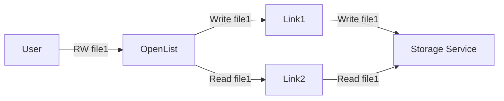
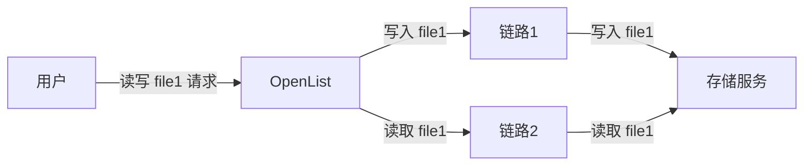
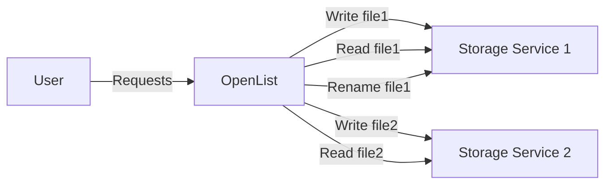
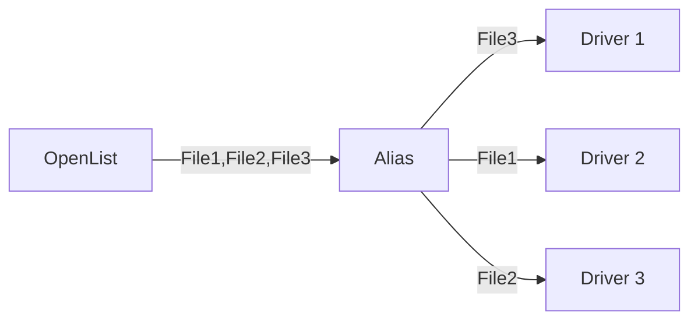
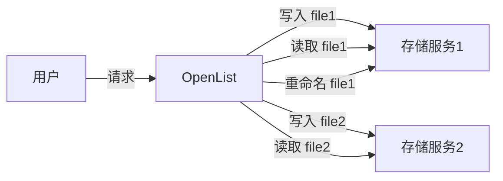
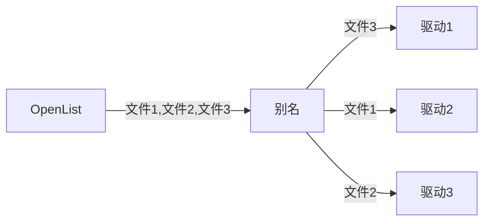
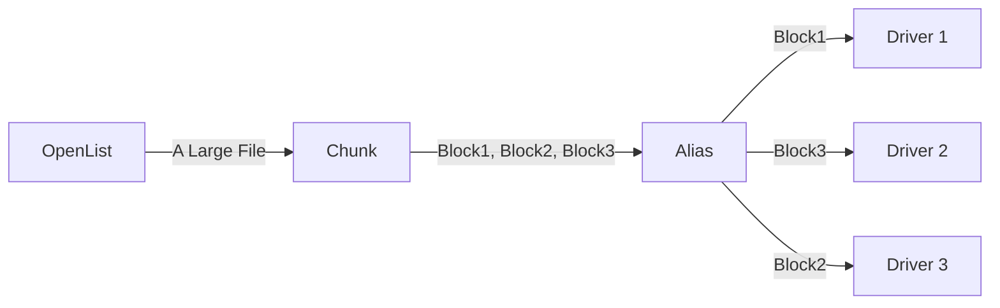
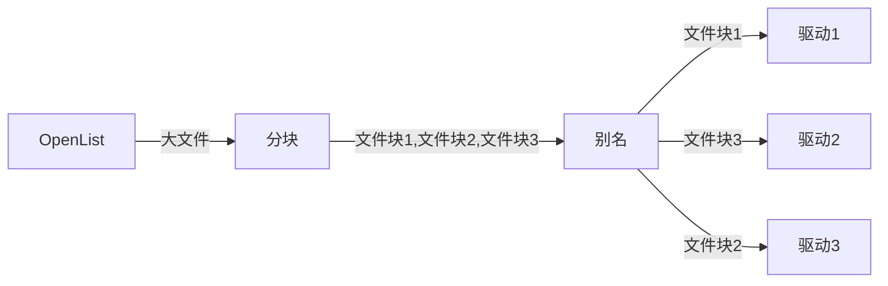
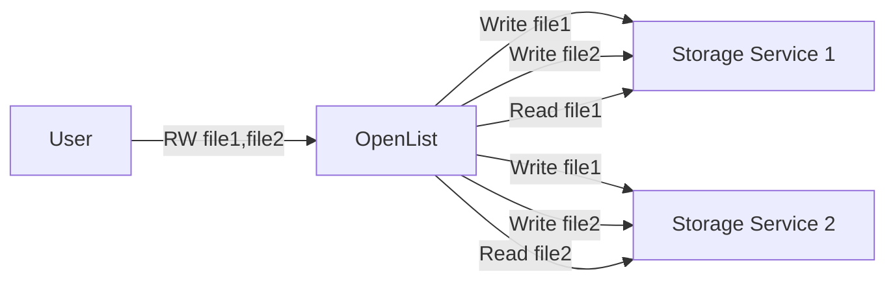
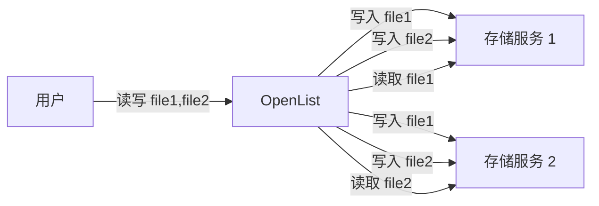

---
title:
  en: Load balancing
  zh-CN: 负载均衡
categories:
  - guide
  - advanced
top: 90
---

## Link load balancing { lang="en" }

## 链路负载均衡 { lang="zh-CN" }

::: en
Link load balancing distributes traffic across multiple links to alleviate bandwidth pressure on any single link. This load balancing mechanism is only applicable when traffic arrives at the same storage service via multiple distinct links. The system assumes that the drivers participating in the load balancing can always automatically maintain content consistency and will simply forward all requests in a round-robin manner:

To perform this load balancing mechanism, mount the first driver normally, and then add the remaining load-balancing drivers using a mount path formatted as `first storage mount path + .balance + any additional content`.

E.g:

- Storage 1: `test`
- Storage 2: `test.balance1`
- Storage 3: `test.balance2`
- Storage 4: `test.balance3`
- ...
- Storage n: `test.balancen`

The first is marked with a red box. It is the main mount, which is displayed on the front page. The remaining nine are the first load balancing on the first one.
:::
::: zh-CN
链路负载均衡用于在多条链路上分担流量，以减轻单条链路的带宽压力。这种负载均衡机制仅用于流量从多条不同的链路抵达同一个存储服务的情况，系统将假定参与负载均衡的驱动总能自动保持内容一致，并简单地轮询转发所有请求：

要使用这种负载均衡机制，请正常挂载第一个驱动，其余负载均衡驱动以`第一个存储挂载路径 + .balance + 任何其他内容`为挂载路径添加。

例如：

- 存储1：`test`
- 存储2：`test.balance1`
- 存储3：`test.balance2`
- 存储4：`test.balance3`
- ...
- 存储n：`test.balancen`

第一个带红框标记的为主挂载，也就是在前端页面显示的，后面剩下的九个就是对第一个进行负载均衡。
:::

## Storage load balancing { lang="en" }

## 存储负载均衡 { lang="zh-CN" }

::: en
Storage Load Balancing is used to distribute storage occupancy across multiple storage services, achieving the effect of abstracting multiple storage spaces into one large storage space with a capacity equal to the sum of all individual spaces (similar to RAID 0). The system will assign each uploaded file to a random storage service and forward all read and modification requests for that file to that specific service:

This type of load balancing can be implemented using the putting load balancing feature of the [Alias](/guide/drivers/alias) driver, with the following configuration:

- **Reading conflict policy**: **Get the file corresponding to the first conflict path** (The load balancing function of the Rading conflict policy is used to implement the load balancing described in the [Multi-source reading load balancing](/guide/advanced/balance#multi-source-reading-load-balancing) section. Based on the principles of the two load balancing schemes, enabling both simultaneously does not achieve a 1+1>=2 effect).
- **Writing conflict policy**: Choose either **Allow full conflict paths** or **Write into all conflict paths** (If the **Write into the first conflict path** policy is used, folder creation operations will only be forwarded to one driver. This will cause that folder and its descendant folders to be unable to continue load balancing as they won't exist on other drivers).
- **Putting conflict policy**: Choose one of **Random load balancing**, **Weighted random load balancing based on remaining space**, or **Strict weighted random load balancing based on remaining space** according to your needs.

The effect achieved with the above configuration:

:::
::: zh-CN
存储负载均衡用于在多个存储服务上分担空间占用，实现多个存储空间抽象为一个容量为所有存储空间之和的大存储空间的效果（类似于 RAID 0），系统将为每个上传的文件分配一个随机的存储服务，并将对于该文件的读取和修改请求全部转发到这个存储服务上：

利用[别名](/guide/drivers/alias)驱动的上传负载均衡功能可以实现此类负载均衡，配置如下：

- 读取冲突策略：**读取首个有效路径**（读取冲突策略的负载均衡功能用于实现[多源读取负载均衡](/guide/advanced/balance#多源读取负载均衡)章节的负载均衡功能，按照两种负载均衡方案的原理，同时开启两种负载均衡功能并不能实现1+1>=2的效果）。
- 写入冲突策略：**仅允许全冲突路径**和**写入所有有效路径**二选一（如果使用**写入首个有效路径**策略，创建文件夹操作将会仅被转发到一个驱动上，这将导致该文件夹及其子孙文件夹由于不存在于其它驱动上，而无法继续负载均衡）。
- 上传冲突策略：**随机负载均衡**、**按容量加权随机负载均衡**和**严格按容量加权随机负载均衡**按照需求三选一。

以上配置实现的效果：

:::

#### Load balancing by file chunks { lang="en" }

#### 按文件块负载均衡 { lang="zh-CN" }

::: en
Sometimes, the files that need to be load-balanced across storage are relatively large, and performing load balancing on a per-file basis is not granular enough. You can use the [Chunk](/guide/drivers/chunk) driver to split files into fixed-size blocks and then apply storage load balancing to these blocks. The specific configuration is as follows:

- **Chunk**: In the remote path, fill in the mount path of the **Alias** driver. Configure other settings as needed.
- **Alias**: Keep the configuration consistent with the description above.

The achieved effect is:

:::
::: zh-CN
有时需要被负载均衡存储的文件比较大，以文件为单位进行负载均衡颗粒度不够细，可以使用[分块](/guide/drivers/chunk)驱动将文件划分为固定大小的文件块，再对文件块进行存储负载均衡，具体配置如下：

- 分块：远程路径填写**别名**驱动的挂载路径，其它配置项按需填写。
- 别名：与上文一致。

实现的效果为：

:::

## Multi-source reading load balancing { lang="en" }

## 多源读取负载均衡 { lang="zh-CN" }

::: en
Multi-source reading load balancing allows copies of a file to be distributed across several different storage services. When a user accesses the file, the system randomly selects one of the copies to return, thereby reducing the uplink bandwidth pressure on any single storage service (similar to RAID 1). The key difference between this load balancing strategy and [Link load balancing](/guide/advanced/balance#link-load-balancing) is that since the load-balanced storage services are treated as multiple, independent file systems with no automatic synchronization, OpenList will forward write operations to **all** storage services, rather than to just one of them:

This type of load balancing can be implemented using the reading load balancing feature of the [Alias](/guide/drivers/alias) driver, with the following configuration:

- **Reading conflict policy**: Choose either **Load balancing on a per-file basis** or **Load balancing on a per-part basis**.
- **Writing conflict policy**: Choose either **Allow full conflict paths** or **Write into all conflict paths** (If the **Write into the first conflict path** policy is used, folder creation operations will be forwarded to only one driver. This will prevent that folder and its descendant folders from continuing to participate in load balancing, as they won't exist on other drivers).
- **Putting conflict policy**: Choose either **Allow full conflict paths** or **Put into all conflict paths** (The load balancing function of the Putting conflict policy is used to implement the load balancing described in the [Storage Load Balancing](/guide/advanced/balance#storage-load-balancing) section. Based on the principles of the two load balancing schemes, enabling both simultaneously does not achieve a 1+1>=2 effect).

:::
::: zh-CN
多源读取负载均衡可以将文件的副本分散在若干不同的存储服务上，当用户访问文件时，系统会随机选择其中一个文件返回，从而降低单个存储服务的上行带宽压力（类似于 RAID 1）。这种负载均衡策略与[链路负载均衡](/guide/advanced/balance#链路负载均衡)的最大不同之处在于，由于负载均衡存储服务被视为多个没有关联，无法自动同步的文件系统，OpenList 将会向**所有**存储服务转发写入操作，而不是向其中一个转发：

利用[别名](/guide/drivers/alias)驱动的读取负载均衡功能可以实现此类负载均衡，配置如下：

- 读取冲突策略：**按文件负载均衡**和**按分片负载均衡**二选一。
- 写入冲突策略：**仅允许全冲突路径**和**写入所有有效路径**二选一（如果使用**写入首个有效路径**策略，创建文件夹操作将会仅被转发到一个驱动上，这将导致该文件夹及其子孙文件夹由于不存在于其它驱动上，而无法继续负载均衡）。
- 上传冲突策略：**仅允许全冲突路径**和**上传到所有有效路径**二选一（上传冲突策略的负载均衡功能用于实现[存储负载均衡](/guide/advanced/balance#存储负载均衡)章节的负载均衡功能，按照两种负载均衡方案的原理，同时开启两种负载均衡功能并不能实现1+1>=2的效果）。

:::
