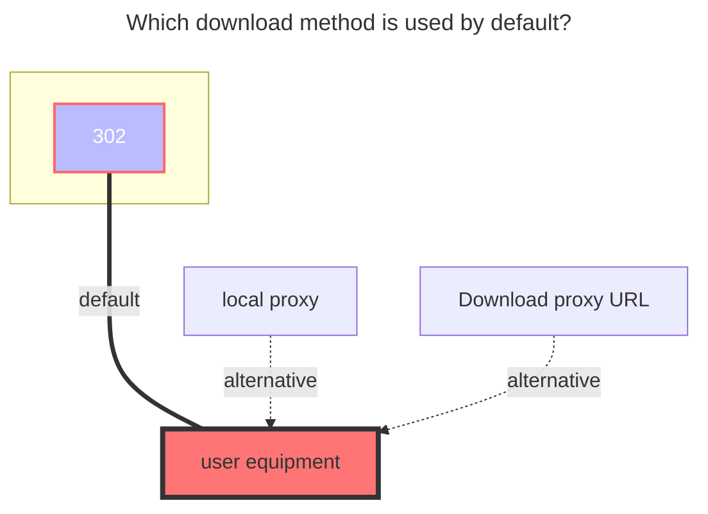
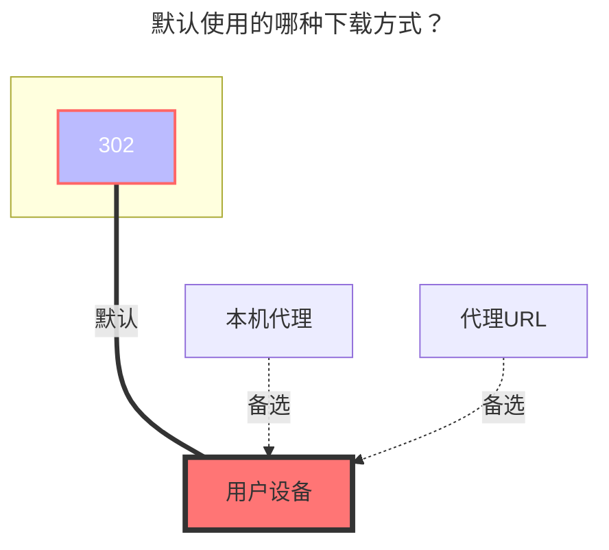

---
title:
  en: 123 Open
  zh-CN: 123 开放平台
# This is the icon of the page
icon: iconfont icon-state
# This control sidebar order
top: 421
# A page can have multiple categories
categories:
  - guide
  - drivers
---

https://www.123pan.com/developer

<!--@include: @/snippets/tos-tip.md-->

## 1. Developer Application { lang="en" }

## 1. 申请开发者 { lang="zh-CN" }

::: en
::: warning
This driver uses the [developer authorization mode](https://123yunpan.yuque.com/org-wiki-123yunpan-muaork/cr6ced/hpengmyg32blkbg8), which grants direct management access to the cloud drive associated with the provided public/private key pair, , so you **must use your client id and client secret**.

The acquired token counts as a login device

:::
::: zh-CN
::: warning
该驱动使用的是[开发者授权模式](https://123yunpan.yuque.com/org-wiki-123yunpan-muaork/cr6ced/hpengmyg32blkbg8),将会直接获得该密钥对应网盘的管理权限，所以**必须使用自己的密钥**。

获取的Token算做一个登录设备

:::

::: en

**Application Method**: Visit the [123 Open Platform Official Website](https://www.123pan.com/developer), read the Developer Agreement, fill in the required fields marked with `*`, and apply for the `client_id` and `client_secret`.Typically, after your application is approved the keys will be sent to your email **remember to check your spam folder, and please keep the keys sent by email safe**.

1. Sign the Developer Agreement

2. Fill out the application materials

3. Wait for the review notification

**Reference Tutorial**: [OpenListTeam/discussions#55](https://github.com/orgs/OpenListTeam/discussions/55)

:::
::: zh-CN

**申请方式**：访问[123开放平台官网](https://www.123pan.com/developer)，阅读开发者协议，填写对应必填项`*`信息，申请`client_id`和`client_secret`，一般来说申请通过后会发送至邮箱，记得检查邮件的垃圾箱，**请保管好通过邮件发送回来的密钥**。

1. 签署开发者协议

2. 填写申请材料

3. 等待审核通知

**参考教程**：[OpenListTeam/discussions#55](https://github.com/orgs/OpenListTeam/discussions/55)

:::

### 2. Get UID { lang="en" }

### 2. 获取 UID { lang="zh-CN" }

::: en

The method to obtain the "Cloud Drive UID" required during the application process is as follows:

1. **Log in to the 123 Cloud Drive web platform**

   Visit the 123 Cloud Drive official website and log in with your account (phone number).

2. **Go to the "Settings" page**

   After logging in, click on the profile picture or username at the top right, and select "Settings" (or directly visit: <https://www.123pan.com/Setting> ).

3. **Find the "Account ID"**

   In the "Account Settings" or "Security Settings" section, locate the "Account ID," which is your "Cloud Drive UID." Copy it and paste it into the application form.

:::

::: zh-CN

填写申请过程中需要填入的“云盘UID”一项获取方式如下：

1. 登录123云盘网页端

   打开123云盘官网，使用你的账号（手机号）登录。

2. 进入“设置”页面

   登录后，点击右上角头像或用户名，选择 「设置」（或直接访问：<https://www.123pan.com/Setting> ）。

3. 查看“账号ID”

   在「账号设置」或「安全设置」栏目中，找到“个人账号ID”，该ID即为您的“云盘UID”，复制并填入即可。

:::

## 4. 在 OpenList 中添加 { lang="zh-CN" }

## 4. Add in OpenList { lang="en" }

### 刷新令牌 { lang="zh-CN" }

### RefreshToken { lang="en" }

::: zh-CN
**留空**
:::
::: en
**keep it empty**
:::

### 客户端ID { lang="zh-CN" }

### Client ID { lang="en" }

::: zh-CN
填入你的客户端ID
:::
::: en
Enter your client ID
:::

### 客户端密钥 { lang="zh-CN" }

### Client Secret { lang="en" }

::: zh-CN
填入你的客户端密钥
:::
::: en
Enter your client secret
:::

### Root Folder ID { lang="en" }

### 根文件夹 ID { lang="zh-CN" }

::: en
The default root directory ID is: `0`

Open the official website of 123 Cloud Drive, navigate to the folder you want to set, and then click the number following `homeFilePath` in the URL.

For example, <https://www.123pan.com/?homeFilePath=123456>

API queries can also be used

The `root folder ID` of this folder is `123456`.
:::
::: zh-CN
默认根目录ID为：`0`

打开 123 网盘官网，点击进入要设置的文件夹时点击 URL 中 `homeFilePath`后面的数字

如 <https://www.123pan.com/?homeFilePath=123456>

也可以使用API查询

这个文件夹的 `根文件夹ID` 即为 `123456`

亦可右键文件夹，选择 `复制文件夹ID`

:::

### Direct Link { lang="en" }

### 使用直链 { lang="zh-CN" }

::: en
Disabled by default; returns standard download links. When enabled, returns CDN direct links, which require VIP access and will consume direct link traffic quota.

Users must manually enable direct link space: Go to the 123 Cloud Drive official website, right-click a folder under the **root directory**, and select `Enable Direct Link Space (VIP)`.
:::
::: zh-CN
默认禁用，返回普通下载链接。启用后，返回 CDN 直链，需要开通 VIP，会消耗直链流量包。

需要用户手动启用直链空间，方法：进入 123 网盘官网，右键**根目录**下的文件夹，选择 `启用直链空间（VIP）`。
:::

### Direct Link Private Key { lang="en" }

### 直链鉴权密钥 { lang="zh-CN" }

::: en
Prerequisite: Enable `Direct Link`.

Leave empty to disable direct link authentication and return permanent direct links.

To prevent your site resources from being maliciously downloaded or stolen, you can configure an "Authentication Key" in 123 Cloud Drive's **Direct Link** → **Basic Function Configuration** → **URL Authentication**, and then set **Authentication Status** to **Enabled**.

After entering the key, the obtained direct links will automatically include authentication parameters.
:::
::: zh-CN
前置条件：开启 `使用直链`。

默认为空，代表不启用直链鉴权，返回永久直链。

为防止站点资源被恶意下载盗用，您可以在 123 云盘的 **直链** -> **基础功能配置** -> **URL鉴权** 中配置 **鉴权密钥**，然后将 **鉴权状态** 设为 **启用**。

填写密钥后，获取到的直链会自动加上鉴权参数。
:::

### Direct Link Valid Duration { lang="en" }

### 直链鉴权有效期 { lang="zh-CN" }

::: en
Prerequisite: Enable `Direct Link` and configure the `Direct Link Private Key`.

Used to generate the expiration timestamp in the direct link authentication parameters.
:::
::: zh-CN
前置条件：开启 `使用直链`，配置 `直链鉴权密钥`。

用于生成直链鉴权参数中的过期时间戳。
:::

## The default download method used { lang="en" }

## 默认使用的下载方式 { lang="zh-CN" }

::: en

:::

::: zh-CN

:::
