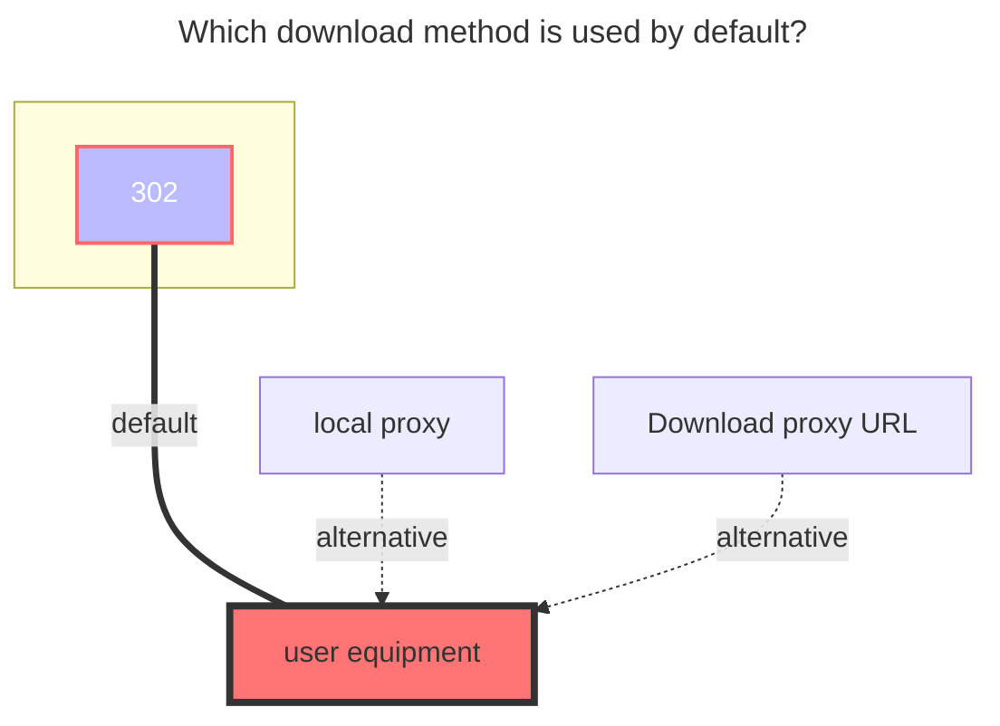
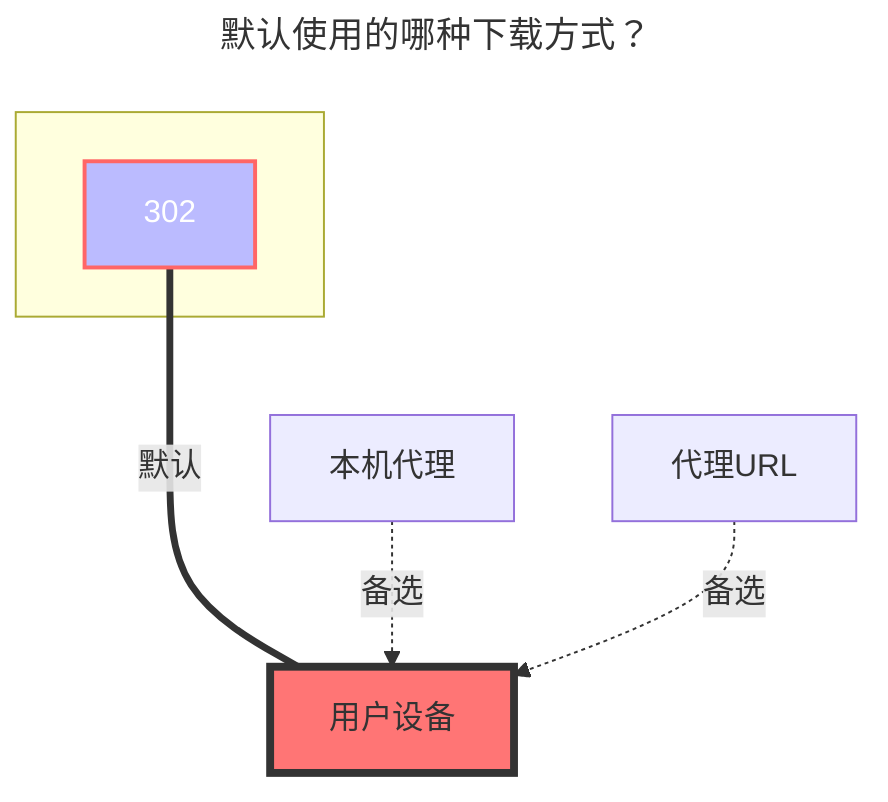

---
title:
  en: 139Yun
  zh-CN: 中国移动云盘
# This is the icon of the page
icon: iconfont icon-state
# This control sidebar order
top: 692
# A page can have multiple categories
categories:
  - guide
  - drivers
---

<!--@include: @/snippets/reverse-tip.md-->

::: en
Cloud disk address: **<https://yun.139.com/>**
:::

::: zh-CN
云盘地址：**<https://yun.139.com/>**
:::

:::en
::: warning
The OpenList version must be greater than `v3.41.0` to use this tutorial.
:::

:::zh-CN
::: warning
OpenList 版本必须大于 `v3.41.0` 才能使用本教程。
:::

:::en
::: tip
Most parameters can be obtained from browser DevTools. See [Search keywords](#search-keywords).
:::

:::zh-CN
::: tip
大部分参数可通过浏览器开发者工具获取。请参考[搜索关键词](#搜索关键词)。
:::

## Quick start { lang="en" }

## 快速开始 { lang="zh-CN" }

::: en
For long-term use, use the new personal cloud with password login fallback. This lets OpenList persist the generated `Authorization` and renew it automatically when possible.

1. Log in to <https://mail.10086.cn/> in your browser.
2. Copy cookies from `mail.10086.cn` and paste them into `MailCookies` as a Cookie Header String, for example `key1=value1; key2=value2`. Do not paste JSON, a table, or one cookie per line.
3. Fill your 139 email/mobile account in `Username`, and fill the corresponding password in `Password`.
4. Add a `139Yun` storage in OpenList and fill:
   - `Type`: `personal_new`
   - `MailCookies`: the cookies copied in step 2
   - `Username`: your account
   - `Password`: your password
   - `Root folder ID`: leave empty or fill `/` for the root directory
5. Leave `Authorization`, `Cloud ID`, and `UserDomainID` empty.
6. Save the storage.

If you only want to mount quickly, you can fill only `Authorization`: log in to <https://yun.139.com/>, find a `hcy/file/list` request in DevTools -> Network, copy the request header `Authorization`, and paste only the content after `Basic `.

If you want to mount a subfolder, enter that folder on the 139Yun website first, then use the current `parentFileId` or `currentCatalogID` as `Root folder ID`.

:::

::: zh-CN
长期使用推荐按“新个人云 + 账号密码回退登录”配置。这样 OpenList 可以持久化生成的 `Authorization`，并在可行时自动续期。

1. 在浏览器登录 <https://mail.10086.cn/>。
2. 复制 `mail.10086.cn` 的 Cookie，以 Cookie Header String 格式粘贴到 `MailCookies`，例如 `key1=value1; key2=value2`。不要粘贴 JSON、表格，也不要一行一个 Cookie。
3. 在 `Username` 填写 139 邮箱/手机号账号，在 `Password` 填写对应密码。
4. 在 OpenList 添加 `139Yun` 存储，并填写：
   - `Type`：`personal_new`
   - `MailCookies`：第 2 步复制的 Cookie
   - `Username`：你的账号
   - `Password`：你的密码
   - `Root folder ID`：挂载根目录时留空或填写 `/`
5. `Authorization`、`Cloud ID`、`UserDomainID` 先留空。
6. 保存存储。

如果只是想快速挂载，也可以只填 `Authorization`：登录 <https://yun.139.com/>，在开发者工具 -> 网络中找到 `hcy/file/list` 请求，复制请求标头里的 `Authorization`，并且只粘贴 `Basic ` 后面的内容。

如果要挂载子文件夹，请先在移动云盘网页端进入该文件夹，再把当前的 `parentFileId` 或 `currentCatalogID` 填到 `Root folder ID`。

:::

## Authentication { lang="en" }

## 鉴权方式 { lang="zh-CN" }

::: en
The driver supports three authentication methods. Use only one method unless you need password login as a fallback.

| Method                  | Fields to fill                        | Notes                                                                                                                                                                                                                                     |
| ----------------------- | ------------------------------------- | ----------------------------------------------------------------------------------------------------------------------------------------------------------------------------------------------------------------------------------------- |
| Password login fallback | `MailCookies`, `Username`, `Password` | Recommended for long-term use. `MailCookies` must be a Cookie Header String, such as `key1=value1; key2=value2`. The driver can generate and persist a new `Authorization`, and can fall back to password login when token refresh fails. |
| Authorization           | `Authorization`                       | Fastest setup. Fill in the value after `Basic `. Do not include `Basic` itself. You may need to update it manually after it expires or refresh fails.                                                                                     |
| Mail cookies fast login | `MailCookies`                         | Use cookies from `mail.10086.cn`. `MailCookies` must be a Cookie Header String and contain valid key-value pairs; `Os_SSo_Sid` and `RMKEY` are used for fast login.                                                                       |

`Username`, `Password`, and `MailCookies` are not required when `Authorization` is valid, even if an old frontend marks them as required.

When using password login fallback, `MailCookies`, `Username`, and `Password` must be filled together.

`MailCookies` should look like the value of an HTTP `Cookie` request header: `key1=value1; key2=value2; key3=value3`.

:::

::: zh-CN
驱动支持三种鉴权方式。除非需要密码登录作为回退，否则选择其中一种即可。

| 方式                 | 需要填写的字段                        | 说明                                                                                                                                                                                   |
| -------------------- | ------------------------------------- | -------------------------------------------------------------------------------------------------------------------------------------------------------------------------------------- |
| 密码登录回退         | `MailCookies`、`Username`、`Password` | 推荐长期使用。`MailCookies` 必须是 Cookie Header String 格式，例如 `key1=value1; key2=value2`。驱动可以生成并持久化新的 `Authorization`，当刷新 Token 失败时也可以回退到账号密码登录。 |
| Authorization        | `Authorization`                       | 配置最快。只填写 `Basic ` 后面的内容，不要包含 `Basic` 本身；过期或刷新失败后可能需要手动更新。                                                                                        |
| 邮箱 Cookie 快速登录 | `MailCookies`                         | 使用 `mail.10086.cn` 的 Cookie。`MailCookies` 必须是 Cookie Header String 格式，并包含有效键值对；快速登录会用到 `Os_SSo_Sid` 和 `RMKEY`。                                             |

当 `Authorization` 有效时，`Username`、`Password`、`MailCookies` 实际不必填写；如果旧前端显示必填，以驱动校验逻辑为准。

使用密码登录回退时，`MailCookies`、`Username`、`Password` 必须同时填写。

`MailCookies` 应该像 HTTP 请求头里的 `Cookie` 值：`key1=value1; key2=value2; key3=value3`。

:::

## Type { lang="en" }

## 类型 { lang="zh-CN" }

::: en
OpenList currently supports four 139Yun storage types. `personal_new` is the default.

| Type           | Use for                   | Root folder ID when empty                                           | Cloud ID     | Notes                                                                                        |
| -------------- | ------------------------- | ------------------------------------------------------------------- | ------------ | -------------------------------------------------------------------------------------------- |
| `personal_new` | New personal cloud        | `/`                                                                 | Not required | New API. Uses direct EOS multipart upload.                                                   |
| `family`       | My Family -> Family Files | Automatically tries to save `data.path` without the `root:/` prefix | Required     | Uses Family Cloud APIs. If auto-detection fails, fill the folder ID manually.                |
| `group`        | Shared group              | Uses `Cloud ID`                                                     | Required     | For groups created by others, manually fill the folder ID to avoid first-level folder loops. |
| `personal`     | Old personal cloud        | `root`                                                              | Not required | Legacy personal cloud. Most accounts have been migrated to `personal_new`.                   |

:::

::: zh-CN
OpenList 目前支持四种中国移动云盘类型，默认类型是 `personal_new`。

| 类型           | 适用场景             | 根文件夹 ID 为空时                             | Cloud ID | 说明                                                                  |
| -------------- | -------------------- | ---------------------------------------------- | -------- | --------------------------------------------------------------------- |
| `personal_new` | 新个人云             | `/`                                            | 不需要   | 新 API，使用 EOS 直连分片上传。                                       |
| `family`       | 我的家庭 -> 家庭文件 | 自动尝试保存去掉 `root:/` 前缀后的 `data.path` | 必填     | 使用家庭云接口。自动获取失败时需要手动填写文件夹 ID。                 |
| `group`        | 共享群组             | 使用 `Cloud ID`                                | 必填     | 如果挂载别人创建的共享群，建议手动填写文件夹 ID，避免一级文件夹循环。 |
| `personal`     | 旧个人云             | `root`                                         | 不需要   | 旧个人云。多数账号已经迁移到 `personal_new`。                         |

:::

:::en
::: warning
After changing `Type`, clear or update `Root folder ID`, then save the storage again.
:::

:::zh-CN
::: warning
更改 `Type` 后，请清空或重新填写 `Root folder ID`，再保存存储。
:::

## Root folder ID { lang="en" }

## 根文件夹 ID { lang="zh-CN" }

::: en
`Root folder ID` specifies the mounted directory.

- `personal_new`: use `/` for the root. For a subfolder, use the folder ID from `parentFileId` or `currentCatalogID`.
- `family`: leave empty to let OpenList try to read `data.path` automatically. When filling manually, remove the `root:/` or `root:` prefix.
- `group`: leave empty only when mounting your own group root. For a subfolder or a group created by others, fill the folder ID manually.
- `personal`: use `root` for the legacy root.

Do not add extra `/` around subfolder IDs. For example, use `abc123`, not `/abc123`.
:::

::: zh-CN
`Root folder ID` 用于指定要挂载的目录。

- `personal_new`：根目录填写 `/`。挂载子文件夹时，使用 `parentFileId` 或 `currentCatalogID` 中的文件夹 ID。
- `family`：留空时 OpenList 会尝试自动读取 `data.path`。手动填写时，需要去掉 `root:/` 或 `root:` 前缀。
- `group`：只有挂载自己共享群根目录时适合留空。挂载子文件夹或别人创建的共享群时，建议手动填写文件夹 ID。
- `personal`：旧个人云根目录使用 `root`。

手动填写子文件夹 ID 时不要额外添加 `/`。例如填写 `abc123`，不要填写 `/abc123`。

:::

## Cloud ID { lang="en" }

## Cloud ID { lang="zh-CN" }

::: en
`Cloud ID` is required only for `family` and `group`.

- `family`: family cloud ID.
- `group`: group ID.
- `personal_new` and `personal`: leave empty.

:::

::: zh-CN
`Cloud ID` 只在 `family` 和 `group` 类型下需要填写。

- `family`：家庭云 ID。
- `group`：群组 ID。
- `personal_new` 和 `personal`：留空。

:::

## User domain ID { lang="en" }

## 用户域 ID { lang="zh-CN" }

::: en
`UserDomainID` is the `ud_id` value in cookies. It is optional for mounting and is mainly used to show disk usage in storage details. If it is empty, file listing and downloads can still work, but capacity statistics are unavailable.

:::

::: zh-CN
`UserDomainID` 是 Cookie 中的 `ud_id`。它不是挂载必填项，主要用于在存储详情中显示容量统计。留空时仍可列目录和下载，但无法显示容量信息。

:::

## Advanced options { lang="en" }

## 高级选项 { lang="zh-CN" }

::: en

- `Custom upload part size`: upload part size in bytes. `0` means automatic. The driver uses `100 MB` by default and increases it to `512 MB` for files larger than `30 GB`.
- `Report real size`: enabled by default. For old personal, family, and group uploads, it reports the real file size to the upstream API.
- `Use large thumbnail`: disabled by default. Enable it to prefer large image thumbnails when the new personal cloud API returns them.

:::

::: zh-CN

- `Custom upload part size`：上传分片大小，单位为字节。`0` 表示自动。驱动默认使用 `100 MB`，文件大于 `30 GB` 时会自动使用 `512 MB`。
- `Report real size`：默认开启。旧个人云、家庭云、共享群上传时，会向上游接口上报真实文件大小。
- `Use large thumbnail`：默认关闭。开启后，新个人云接口返回大图缩略图时会优先使用大图。

:::

## Proxy Range { lang="en" }

## 代理 Range { lang="zh-CN" }

::: en
`Proxy Range` is enabled by default in the driver, but it only takes effect after enabling `Web Proxy` or `WebDAV Native Proxy`.

Enable proxy mode when a player or downloader cannot handle the upstream 302 link correctly, for example when video playback fails, seeking fails, or resumable downloads do not work.

:::

::: zh-CN
驱动默认开启 `Proxy Range`，但它需要配合 `Web 代理` 或 `WebDAV 本地代理` 才会生效。

当播放器或下载器不能正确处理上游 302 链接时，建议开启代理模式，例如视频无法播放、拖动进度失败或不支持断点续传。

:::

## Search keywords { lang="en" }

## 搜索关键词 { lang="zh-CN" }

::: en
Use browser DevTools to find the fields below.

| Need                      | Where to search                                     | Field                                                          |
| ------------------------- | --------------------------------------------------- | -------------------------------------------------------------- |
| `Authorization`           | Network request headers on `yun.139.com`            | `Authorization: Basic ...`; copy only the value after `Basic ` |
| New personal folder ID    | `hcy/file/list` request, or browser storage         | `parentFileId` or `currentCatalogID`                           |
| Family Cloud ID           | `queryContentList` request payload                  | `cloudID`                                                      |
| Family folder ID          | `queryContentList` response                         | `data.path`; remove `root:/` or `root:` when filling manually  |
| Group ID                  | `queryGroupContentList` request payload             | `groupID`                                                      |
| Group folder ID           | `queryGroupContentList` request payload or response | `path` or folder ID                                            |
| Legacy personal folder ID | `getDisk` request or response                       | `catalogID`                                                    |
| `UserDomainID`            | Browser cookies                                     | `ud_id`                                                        |

In Firefox, cookies and local storage can be easier to find in DevTools -> Storage.

:::

::: zh-CN
使用浏览器开发者工具查找以下字段。

| 需要获取          | 查找位置                               | 字段                                                 |
| ----------------- | -------------------------------------- | ---------------------------------------------------- |
| `Authorization`   | `yun.139.com` 的网络请求标头           | `Authorization: Basic ...`；只复制 `Basic ` 后面的值 |
| 新个人云文件夹 ID | `hcy/file/list` 请求，或浏览器存储     | `parentFileId` 或 `currentCatalogID`                 |
| 家庭云 ID         | `queryContentList` 请求载荷            | `cloudID`                                            |
| 家庭云文件夹 ID   | `queryContentList` 响应                | `data.path`；手动填写时去掉 `root:/` 或 `root:`      |
| 共享群 ID         | `queryGroupContentList` 请求载荷       | `groupID`                                            |
| 共享群文件夹 ID   | `queryGroupContentList` 请求载荷或响应 | `path` 或文件夹 ID                                   |
| 旧个人云文件夹 ID | `getDisk` 请求或响应                   | `catalogID`                                          |
| `UserDomainID`    | 浏览器 Cookie                          | `ud_id`                                              |

Firefox 中可以在开发者工具 -> 存储中查看 Cookie 和本地存储，通常更容易找到 `Authorization`、`ud_id` 和 `currentCatalogID`。

:::

### Personal new { lang="en" }

### 新个人云 { lang="zh-CN" }

::: en
Choose one of the following methods to find `Authorization` and folder ID.

If you want the folder ID of a subfolder, enter that subfolder first and then inspect the new request or storage value. Otherwise, the old folder ID may still be displayed.

:::

::: zh-CN
以下方法可用于查找 `Authorization` 和文件夹 ID。

如果要查看子文件夹 ID，请先进入该子文件夹，再查看新的请求或存储值，否则看到的可能仍是之前的文件夹 ID。

:::

### Personal cloud { lang="en" }

### 个人云 { lang="zh-CN" }

### Family cloud { lang="en" }

### 家庭云 { lang="zh-CN" }

:::en

::: details Teaching video
Although the video is for V2, the method for obtaining folder ID and Cloud ID is still similar.

**<https://www.bilibili.com/video/BV1US4y1w79a>**
:::

:::zh-CN

::: details 详细教学视频
虽然视频是 V2 版本，但获取目录 ID 和 Cloud ID 的方式仍然类似。

**<https://www.bilibili.com/video/BV1US4y1w79a>**
:::

### OpenList fill in examples { lang="en" }

### OpenList 挂载填写示例 { lang="zh-CN" }

::: en

- `Authorization`: fill in only the content after `Basic `.
- New personal folder ID: enter the target folder first, then use the current `currentCatalogID`.

:::

::: zh-CN

- `Authorization`：只填写 `Basic ` 后面的内容。
- 新个人云文件夹 ID：先进入目标文件夹，再使用当前的 `currentCatalogID`。

:::

## Download method { lang="en" }

## 下载方式 { lang="zh-CN" }

::: en
The default download method is 302 redirection. If a player such as PotPlayer cannot play through 302, switch that mount to proxy mode or mount it through WebDAV with `WebDAV Native Proxy`.

:::

::: zh-CN
默认下载方式是 302 跳转。如果 PotPlayer 等播放器无法通过 302 播放，可以将该挂载切换为代理模式，或通过启用 `WebDAV 本地代理` 的 WebDAV 挂载播放。

:::
