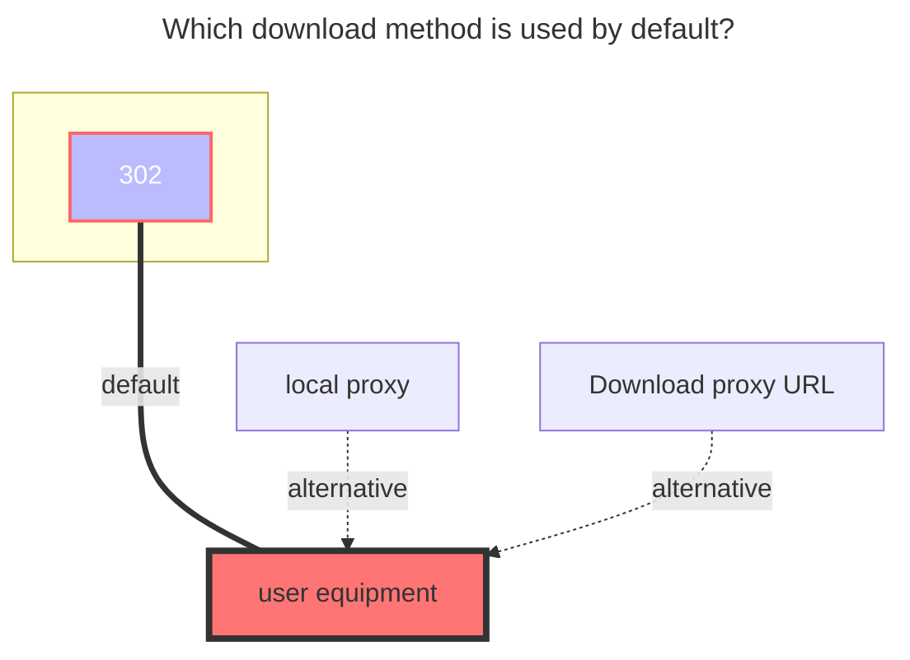
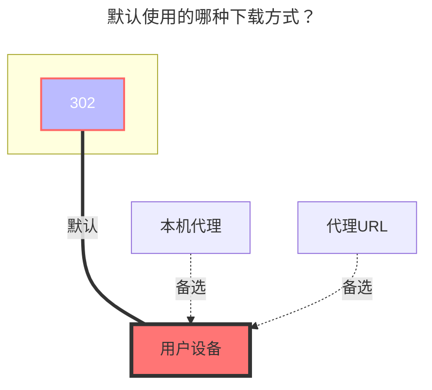

---
title:
  en: AutoIndex
  zh-CN: AutoIndex
icon: iconfont icon-state
top: 350
categories:
  - guide
  - drivers
---

::: en

The AutoIndex driver is used to mount directory index pages built into HTTP servers, such as the [Nginx Source Index](https://nginx.org/download/) and [Redis Releases](https://download.redis.io/releases/).

This driver essentially scrapes page information directly and requires manually specifying XPaths, making it suitable for scraping pages that are not directory index pages as well.

:::

::: zh-CN

AutoIndex 驱动用于挂载 HTTP 服务器内置的目录索引页，如[Nginx Source Index](https://nginx.org/download/)、[Redis Releases](https://download.redis.io/releases/)。

该驱动本质上是直接爬取页面信息，需要手动填写 XPath，因此也可以用来爬取那些不是目录索引页的页面。

:::

## Setup Instructions { lang="en" }

## 配置说明 { lang="zh-CN" }

::: en

- **URL:** The website address. If no scheme is included, `https://` will be automatically added. To mount a subpath, append it directly to the end of the URL. For example, <https://archive.apache.org/dist/tomcat/> can be used to mount the subpath `tomcat/` under <https://archive.apache.org/dist/>. Required.
- **Entry XPath:** An XPath expression used to match each entry node in the file list. The result of this expression must be a **node-set**, where each node corresponds to a file entry. Required.
- **Filename XPath:** Within the context of each node matched by **Entry XPath**, this XPath expression is used to extract the filename. The result can be a node, node-set, or string. If the result is a node or node-set, the innerText of the first node will be used as the filename. Required.
- **Modification time XPath:** Within the context of each node matched by **Entry XPath**, this XPath expression is used to extract the file modification time. The result can be a node, node-set, or string. If the result is a node or node-set, the innerText of the first node will be used as the modification time string. Optional. If left blank, no node is matched, or the date format is unrecognizable, the current time will be used by default.
- **File size XPath:** Within the context of each node matched by **Entry XPath**, this XPath expression is used to extract the file size. The result can be a node, node-set, number, or string. If the result is a node or node-set, the innerText of the first node will be parsed as the file size. Optional. If left blank, no node is matched, or the content cannot be recognized as a valid size, the driver will return a file size of 0.
- **Ignore filenames:** Used to filter out entries that should not be crawled (e.g., list headers, parent directory links). Enter the filenames to ignore (without the trailing `/`).
- **Modification date format:** Enter a time string matching the format displayed on the page (refer to the Go time template: `Mon Jan 2 15:04:05 -0700 MST 2006`, see also: [Go Time Formatting Documentation](https://golang.org/pkg/time/#pkg-constants)).

:::
::: zh-CN

- **URL：** 网站地址，如不含 scheme 会自动添加`https://`，需要挂载子路径可直接在链接结尾添加，如<https://archive.apache.org/dist/tomcat/>可用于挂载<https://archive.apache.org/dist/>的子路径`tomcat/`，必填。
- **条目 XPath：** 用于匹配文件列表中每个条目节点的 XPath 表达式，该表达式的执行结果必须为**节点集**，其中每个节点对应一个文件条目。此项为必填。
- **文件名 XPath：** 在**条目 XPath** 所匹配的每个节点上下文中，用于提取文件名的 XPath 表达式。表达式结果可以是节点、节点集或字符串。若结果为节点或节点集，系统将取首个节点的 innerText 作为文件名。此项为必填。
- **修改时间 XPath：** 在**条目 XPath** 所匹配的每个节点上下文中，用于提取文件修改时间的 XPath 表达式。表达式结果可以是节点、节点集或字符串。若结果为节点或节点集，系统将取首个节点的 innerText 作为修改时间字符串。选填，若未填写、未匹配到节点或日期格式无法识别，则默认使用当前时间。
- **文件大小 XPath：** 在**条目 XPath** 所匹配的每个节点上下文中，用于提取文件大小的 XPath 表达式。表达式结果可以是节点、节点集、数字或字符串。若结果为节点或节点集，系统将取首个节点的 innerText 并尝试解析为文件大小。选填，若未填写、未匹配到节点或内容无法识别为有效大小，则驱动返回的文件大小为 0。
- **忽略文件名：** 用于过滤不需要抓取的条目（例如列表表头、返回上级目录的链接等）。填写希望忽略的文件名（无需包含结尾的`/`）。
- **修改日期格式：** 填写与页面显示格式对应的时间字符串（参考 Go 时间模板：`Mon Jan 2 15:04:05 -0700 MST 2006`，另请参阅： [Go时间格式化文档](https://golang.org/pkg/time/#pkg-constants)）

:::

## Reference Configuration { lang="en" }

## 参考配置 { lang="zh-CN" }

::: en
The following configurations can be used to mount the auto-index pages of some HTTP servers. Since the style of auto-index pages may change with updates to the HTTP server version, the configurations provided below are for reference only and are not guaranteed to work across all versions. You are welcome to supplement available configurations for other HTTP servers in the comments.
:::
::: zh-CN
以下为挂载部分 HTTP 服务器 auto-index 页的可用配置。由于 auto-index 页的样式可能随 HTTP 服务器的版本更新而发生改变，以下配置仅供参考，不保证在所有版本中都可以使用。欢迎在评论中补充其它 HTTP 服务器的可用配置。
:::

#### Nginx (Tested on 1.29.0) { lang="en" }

#### Nginx（测试版本 1.29.0） { lang="zh-CN" }

::: en

- Entry XPath: `//pre/a`
- Filename XPath: `.`
- Modification time XPath: `substring(normalize-space(./following-sibling::text()[1]),1,17)`
- File size XPath: `substring(normalize-space(./following-sibling::text()[1]),19)`
- Modification date format: `02-Jan-2006 15:04`

:::
::: zh-CN

- 条目 XPath：`//pre/a`
- 文件名 XPath：`.`
- 修改时间 XPath：`substring(normalize-space(./following-sibling::text()[1]),1,17)`
- 文件大小 XPath：`substring(normalize-space(./following-sibling::text()[1]),19)`
- 修改时间格式：`02-Jan-2006 15:04`

:::

#### Apache httpd (Tested on 2.4.18) { lang="en" }

#### Apache httpd（测试版本 2.4.18） { lang="zh-CN" }

::: en

- Entry XPath: `//table/tbody/tr[position() > 2]`
- Filename XPath: `./td[2]/a`
- Modification time XPath: `./td[3]`
- File size XPath: `./td[4]`
- Modification date format: `2006-01-02 15:04`

:::
::: zh-CN

- 条目 XPath：`//table/tbody/tr[position() > 2]`
- 文件名 XPath：`./td[2]/a`
- 修改时间 XPath：`./td[3]`
- 文件大小 XPath：`./td[4]`
- 修改时间格式：`2006-01-02 15:04`

:::

#### Caddy (Tested on v2.10.2) { lang="en" }

#### Caddy（测试版本 v2.10.2） { lang="zh-CN" }

::: en

- Entry XPath: `//table/tbody/tr`
- Filename XPath: `./td[2]/a/span`
- Modification time XPath: `./td[4]/time`
- File size XPath: `./td[3]/div/div[2]`
- Modification date format: `01/02/2006 03:04:05 PM -07:00`

:::
::: zh-CN

- 条目 XPath：`//table/tbody/tr`
- 文件名 XPath：`./td[2]/a/span`
- 修改时间 XPath：`./td[4]/time`
- 文件大小 XPath：`./td[3]/div/div[2]`
- 修改时间格式：`01/02/2006 03:04:05 PM -07:00`

:::

#### Python SimpleHTTP (Tested on 3.11.5-0.6) { lang="en" }

#### Python SimpleHTTP（测试版本 3.11.5-0.6） { lang="zh-CN" }

::: en

- Entry XPath: `//ul/li`
- Filename XPath: `./a`
- Modification time XPath: leave blank
- File size XPath: leave blank
- Modification date format: leave blank

:::
::: zh-CN

- 条目 XPath：`//ul/li`
- 文件名 XPath：`./a`
- 修改时间 XPath：留空
- 文件大小 XPath：留空
- 修改时间格式：留空

:::

## The default download method used { lang="en" }

## 默认使用的下载方式 { lang="zh-CN" }

::: en

:::
::: zh-CN

:::
