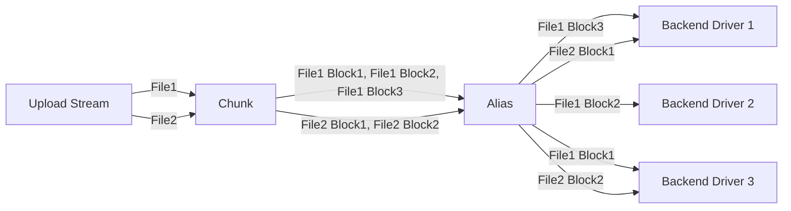
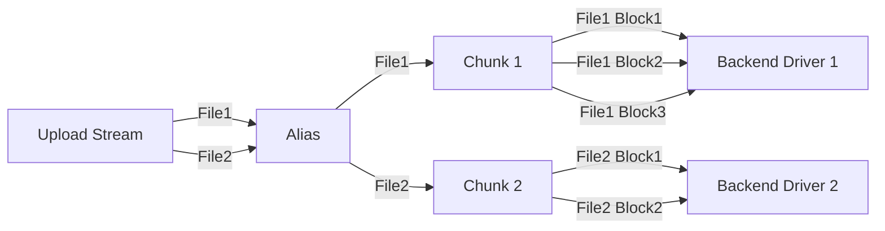
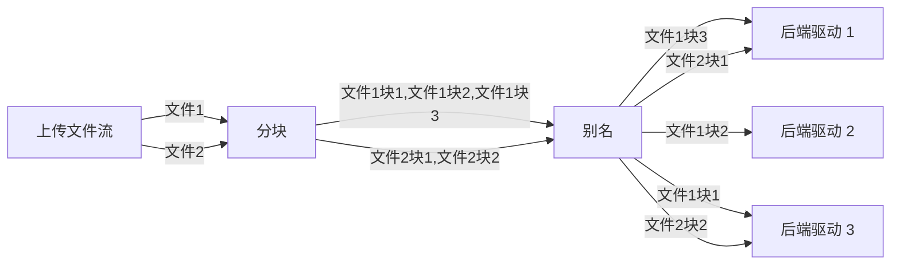
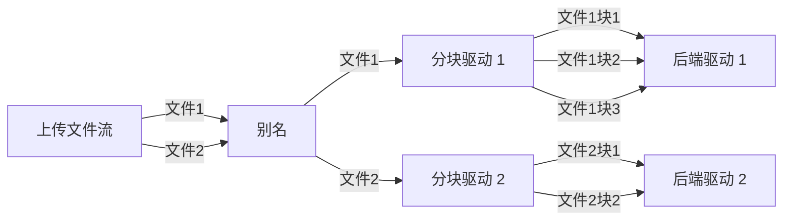

---
title:
  en: Chunk
  zh-CN: 分块（Chunk）
icon: iconfont icon-state
top: 995
categories:
  - guide
  - drivers
tag:
  - Storage
  - Guide
sticky: true
star: true
---

::: en
The Chunk is used to split large files into multiple file chunks. Each chunk is stored as an independent file on the backend driver.

The size of each file chunk can be manually configured by the user. Except for the last chunk of each file—which is smaller than the configured size—all other chunks are always equal to the specified size.

A chunked file is stored as a folder on the backend driver, containing all its chunks.

:::

::: zh-CN
分块驱动用于将大文件拆分为多个文件块，每个文件块以一个独立文件的形式存储在后端驱动上。

每个文件块的大小可由用户手动设定，除了每个文件的最后一个文件块的大小小于该设定值外，其余文件块的大小总是等于该设定值。

被分块的文件会以文件夹的形式存在于后端驱动上，文件夹内是该文件的所有分块。

:::

## Setup Instructions { lang="en" }

## 配置说明 { lang="zh-CN" }

::: en

- **Remote path:** The real storage path of the chunked files. This path must be the root path or a subpath of another driver.
- **Part size:** Maximum chunk size / Size of chunks except the last, in bytes.
- **Chunk large file only:** Whether to only chunk files larger than Part size.
  - When disabled:
    
  - When enabled:
    
- **Chunk prefix:** The prefix for the names of chunk folders stored on the backend driver, representing a chunked file. This is used to identify whether a folder is a regular folder or a chunked file storing folder, and therefore cannot be empty.
- **Custom ext:** Custom suffix for chunk names, used to bypass limitations of certain drivers.
  - When left empty:
  - When setting to `.jpg`:

::: warning TIP
Once the driver is created, Custom ext should not be modified again, otherwise previously uploaded chunked files will become unrecognizable.

If modification is necessary, you must manually change the suffix of all chunks on the backend driver afterward.
:::

::: en

- **Store hash:** Whether to store the hashes of chunked files in the chunk folder as well.
  This feature does not actively compute hashes; it only stores the hashes that the file already carries when uploading.
- **Num list workers:** When handling `List` requests, if a folder contains chunk folders, it is necessary to further list those chunk folders to retrieve information such as file size and hash value. Using multiple threads can speed up this process. A higher number of threads consumes more CPU and bandwidth resources but also increases speed. It is recommended to be disabled (set to 1) when the backend driver has API rate limiting.

:::

::: zh-CN

- **远程存储路径：** 分块后文件的真实存储路径，该路径必须是其它驱动的根路径或子路径。
- **分块大小：** 文件块的最大大小 / 除最后一个文件块外文件块的大小，单位：字节。
- **仅对大文件分块：** 是否仅对大于或等于“分块大小”的文件进行分块。
  - 关闭时：
    
  - 开启时：
    
- **分块前缀：** 存储在后端驱动上，表示一个被分块文件的分块文件夹名称的前缀。此为分块驱动判断一个文件夹是一个正常的文件夹还是一个被分块文件的依据，因此不能为空。
- **自定义扩展名：** 自定义文件块名称后缀，用于绕过某些驱动的限制：
  - 设置为空（默认值）：
    
  - 设置为`.jpg`：
    

::: warning 提示
驱动创建完毕后，不应再修改自定义扩展名，否则之前上传的分块文件将无法识别。

如必须修改，修改后需要在后端驱动手动修改所有文件块的后缀名。
:::

::: zh-CN

- **存储哈希值：** 是否在分块文件夹中同时存储完整文件的哈希值。
  该功能不会主动计算文件的哈希值，只会存储文件在上传时就已经携带的哈希值。
- **列举分块文件夹线程数：** 处理`List`请求时，如果文件夹中有分块文件夹，需要继续列举分块文件夹以获取文件大小、哈希值等信息，此时使用多线程可以加速这一过程。线程数越大，消耗 CPU 和带宽资源越多，速度越快。后端驱动具有 API 限速时建议关闭（设为1）。

:::

## Use in combination with Crypt { lang="en" }

## 与 Crypt 结合使用 { lang="zh-CN" }

::: en
If you need to both chunk and encrypt files, it is recommended to **encrypt first, then chunk**. Specifically, set Remote path of the [Crypt](/guide/drivers/crypt) driver to the mount path of the **Chunk** driver, and set Remote path of the **Chunk** driver to the actual storage path of the files.

- Best practice:

- Bad practice:

**Reason**: The bad practice involves storing a series of encryption metadata in each file chunk, which consumes more space. It also fails to guarantee that the chunks adhere to the user-specified maximum size, thereby undermining the purpose of file chunking.

To perform emergency recovery on an encrypted file chunked according to the best practice, you simply need to concatenate all the chunks in order and then proceed with recovery.
:::

::: zh-CN
如果既需要对文件进行分块，又需要对文件进行加密，推荐**先加密后分块**，即将 [Crypt](/guide/drivers/crypt) 驱动的远程存储路径设为**分块**驱动的挂载路径，将**分块**驱动的远程存储路径设为文件真实存储路径。

- 正确实践：

- 错误实践：

**原因**：错误实践的这种做法在每个文件块中都存储了一系列加密元信息，占用空间更多，也不能保证文件块具有用户给定的最大大小，失去了对文件分块的意义。

如果需要紧急恢复按推荐做法分块的加密文件，只需要按顺序直接拼接所有分块，再进行恢复即可。
:::

## Use in combination with Alias { lang="en" }

## 与别名结合使用 { lang="zh-CN" }

::: en
If you need to store chunked files across multiple load-balanced drivers, you can combine this with the [Alias](/guide/drivers/alias) driver. For details, refer to [Load Balancing / Load balancing by file chunks](/guide/advanced/balance#load-balancing-by-file-chunks).

It's important to note that, unlike the approach used with Crypt, when combining with Alias, the process should be **chunk first, then load balance**. This means setting the Remote path of the **Chunk** driver to the mount path of the **Alias** driver, and setting the paths within the **Alias** driver to the actual file storage paths.

- Best Practice:

- Bad Practice:

:::
::: zh-CN
如果需要将分块后的文件在多个负载均衡驱动上存储，可以与[别名](/guide/drivers/alias)结合使用，详见[负载均衡 / 按文件块负载均衡](/guide/advanced/balance#按文件块负载均衡)。

需要注意的是，与结合 Crypt 使用的方案不同，与别名结合使用时，应**先分块后负载均衡**，即将**分块**驱动的远程存储路径设为**别名**驱动的挂载路径，将**别名**驱动的路径设为文件真实存储路径。

- 正确实践：

- 错误实践：

:::
