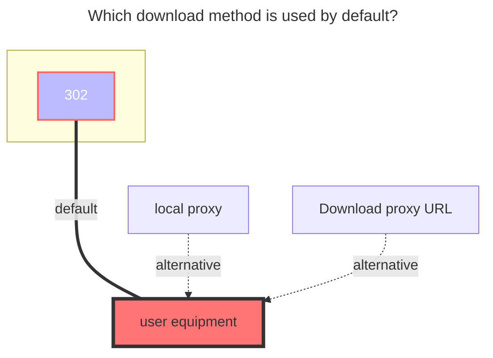
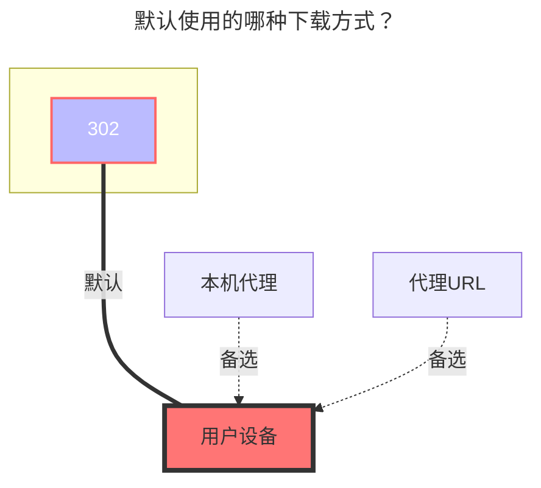

---
title:
  en: CloudFlare-ImgBed
  zh-CN: CloudFlare 图床
icon: iconfont icon-state
top: 700
categories:
  - guide
  - drivers
---

<!--@include: @/snippets/tos-tip.md-->

## 免责声明 { lang="zh-CN" }

## Disclaimer { lang="en" }

::: zh-CN
::: warning
本驱动仅提供与 CloudFlare-ImgBed 后端交互的接口，不对该图床程序本身及其存储渠道的可用性、稳定性负责。
用户需自行决定并配置所使用的存储渠道（如 Cloudflare R2、HuggingFace、S3、Telegram 等），并应严格遵守相关平台及服务提供商的服务条款与使用政策。请勿利用此驱动进行任何违反法律法规、侵犯他人权益或滥用平台资源（如大量消耗免费额度、违规存储分发受版权保护的内容等）的行为。
因用户配置不当、违反平台政策或滥用服务而导致的一切后果（包括但不限于账号封禁、数据丢失、服务中断等），均由用户自行承担，与 OpenList 及其开发者无关。
:::
::: en
::: warning
This driver only provides an interface to interact with the CloudFlare-ImgBed backend and is not responsible for the availability and stability of the image hosting program itself or its storage channels.
Users are solely responsible for determining and configuring the storage channels used (e.g., Cloudflare R2, HuggingFace, S3, Telegram) and must strictly comply with the Terms of Service and acceptable use policies of the relevant platforms and service providers. Do not use this driver for any illegal activities, rights infringement, or abuse of platform resources (e.g., excessive consumption of free quotas, illegal storage/distribution of copyrighted content).
All consequences arising from improper configuration, violation of platform policies, or service abuse (including but not limited to account suspension, data loss, service interruption, etc.) shall be borne by the user. OpenList and its developers shall not be held liable.
:::

## 1. 准备工作 { lang="zh-CN" }

## 1. Preparation { lang="en" }

::: zh-CN
配置该驱动前，需要先部署你自己的 CloudFlare-ImgBed 后端。
项目地址：[MarSeventh/CloudFlare-ImgBed](https://github.com/MarSeventh/CloudFlare-ImgBed)
部署完成后，登录后端管理面板（`https://你的域名/dashboard`），并在系统设置中确保至少配置了一个存储渠道（如 HuggingFace、Cloudflare R2、S3、Telegram 等）。
:::
::: en
Before configuring this driver, you need to deploy your own CloudFlare-ImgBed backend.
Project address: [MarSeventh/CloudFlare-ImgBed](https://github.com/MarSeventh/CloudFlare-ImgBed)
After deployment, log in to the backend dashboard (`https://your-domain/dashboard`), and ensure that at least one storage channel (e.g., HuggingFace, Cloudflare R2, S3, Telegram) is configured in the system settings.
:::

## 2. 在 OpenList 中添加 { lang="zh-CN" }

## 2. Add in OpenList { lang="en" }

### 挂载路径 { lang="zh-CN" }

### Mount Path { lang="en" }

::: zh-CN
填入你希望挂载到的路径，例如 `/imgbed`。
:::
::: en
Enter the path you want to mount to, for example `/imgbed`.
:::

### 根目录路径 { lang="zh-CN" }

### Root Folder Path { lang="en" }

::: zh-CN
默认为 `/`，留空即可。
:::
::: en
Default is `/`, can be left empty.
:::

### 后端 API 地址 { lang="zh-CN" }

### Address { lang="en" }

::: zh-CN
填入你部署的图床服务地址，例如 `https://img.example.com`。无需在末尾添加 `/`。
:::
::: en
Enter the address of your deployed image hosting service, e.g., `https://img.example.com`. No need to add `/` at the end.
:::

### 认证令牌 { lang="zh-CN" }

### Token { lang="en" }

::: zh-CN
填入图床后端系统设置中生成的 API Token。

:::
::: en
Enter the API Token generated in the backend system settings.

:::

### 普通文件渠道名称 { lang="zh-CN" }

### Small Channel Name { lang="en" }

::: zh-CN
通常用于上传小于 20MB 的文件。填入你在图床后端配置的渠道名称（如 `my cfr2`、`my telegram` 等）。
:::
::: en
Typically used for uploading files smaller than 20MB. Enter the channel name configured in your backend (e.g., `my cfr2`, `my telegram`).
:::

### 大文件渠道名称 { lang="zh-CN" }

### Large Channel Name { lang="en" }

::: zh-CN
用于上传大于 20MB 的文件。建议配置支持大文件的渠道（如 `huggingface`）。留空则大文件会回退到普通渠道上传。

:::
::: en
Used for uploading files larger than 20MB. It is recommended to configure a channel that supports large files (e.g., `huggingface`). If left blank, large files will fall back to the small channel for upload.
:::

### 大文件渠道类型 { lang="zh-CN" }

### Large Channel Type { lang="en" }

::: zh-CN
根据大文件渠道选择对应的类型：

- `huggingface`：使用 HuggingFace LFS 直传（支持秒传和分片）
- `telegram` / `cfr2` / `s3` / `discord`：使用图床后端的分片上传接口
  :::
  ::: en
  Select the corresponding type based on your large file channel:
- `huggingface`: Uses HuggingFace LFS direct upload (supports instant upload and chunking)
- `telegram` / `cfr2` / `s3` / `discord`: Uses the backend chunked upload API
  :::

### 上传线程数 { lang="zh-CN" }

### Upload Thread { lang="en" }

::: zh-CN
HuggingFace 分片直传的并发线程数，默认为 `3`，最大为 `32`。网络条件好时可适当增大。
:::
::: en
Concurrent thread count for HuggingFace chunked direct upload, default is `3`, max is `32`. Can be increased if network conditions are good.
:::

## 默认使用的下载方式 { lang="zh-CN" }

## The default download method used { lang="en" }

::: en

:::
::: zh-CN

:::
