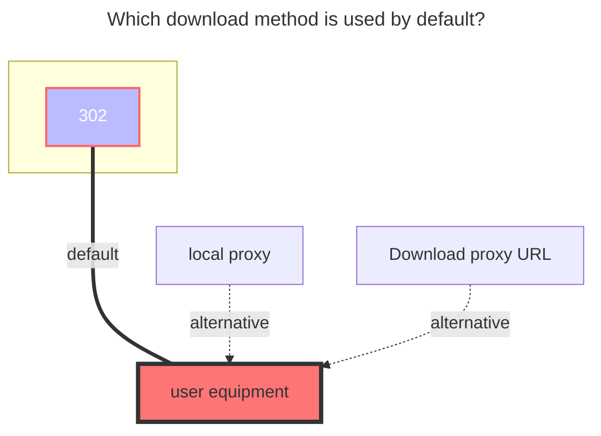
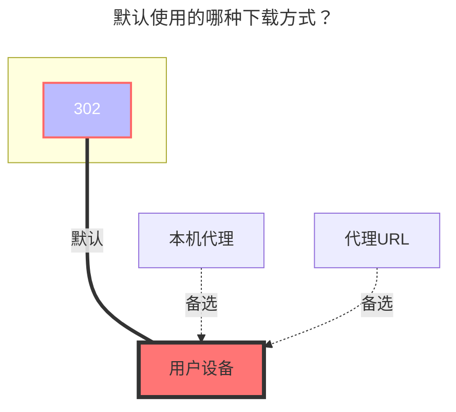

---
title:
  en: CNB Releases
  zh-CN: CNB 发行版
categories:
  - guide
  - drivers
top: 397
---

https://cnb.cool/

## Known issues { lang="en" }

## 已知问题 { lang="zh-CN" }

::: en
CNB releases are not a standard file system and have some unresolved issues. Please do not submit feedback for these.

1. An empty repository needs to be initialized first.
2. Subdirectories are not supported under Tag / Release directories.
3. The OpenAPI upload returns `expires_in_sec` as only 10 seconds. Uploading large files may time out; after time out, the upload continues but returns `invalid token`. Therefore, a local timeout mechanism is added to automatically stop uploading when the set time is reached, avoiding failed uploads and wasted bandwidth.
4. `Move`, `Copy`, and `Rename` operations are not supported.
5. Only when `UseTagName` is disabled, renaming can be done by modifying the Release name.

:::
::: zh-CN
CNB 发行版非正常文件系统，存在一些无法解决的问题，请勿反馈。

1. 空仓库需要先初始化
2. Tag / Release 目录下不支持子目录
3. OpenAPI 上传返回 `expires_in_sec` 仅为10秒，上传大文件会超时，超时后仍会继续上传然后返回 `token 无效`，因此增加了本地超时机制，达到上传接口返回的设定时间时自动停止上传，避免上传失败、浪费流量
4. 不支持 `移动`、`复制`、`重命名` 操作
5. 仅支持在关闭 `使用Tag名称` 时，通过修改 Release 的名称进行重命名

:::

## Parameters { lang="en" }

## 参数 { lang="zh-CN" }

### Repo { lang="en" }

### 仓库 { lang="zh-CN" }

::: en
Only one repository can be specified. To reuse a token, please use the [Reference](common.md#reference) feature.
:::
::: zh-CN
仅支持填写一个仓库。如需复用 Token，请使用 [引用](common.md#引用) 功能。
:::

### Token { lang="en" }

### 访问令牌 { lang="zh-CN" }

::: en
Access token. No need to include `Bearer`. Supports the [Reference](common.md#reference) feature.

How to obtain: After logging in, go to `Personal Settings` - [Access Token](https://cnb.cool/profile/token) -> `Add Access Token`.

For listing, grant the `repo-code:r` permission. For modifications, grant the `repo-code:rw` permission.
:::
::: zh-CN
访问令牌。无需填写 `Bearer`。支持 [引用](common.md#引用) 功能。

获取方法：登录后，进入 `个人设置` - [访问令牌](https://cnb.cool/profile/token) -> `添加访问令牌`。

对于获取列表，需授予 `repo-code:r` 权限。对于修改，需授予 `repo-code:rw` 权限。
:::

### UseTagName { lang="en" }

### 使用Tag名称 { lang="zh-CN" }

::: en
Use the original Tag name instead of the Release name.

By default, this is disabled and the Release name is used, which supports renaming. Tag names cannot be changed once created. When creating a new folder for the first time, a Tag with the folder name will be published. Renaming an existing Release will modify the Release name.
:::
::: zh-CN
使用原始的 Tag 名称而不是 Release 名称。

默认关闭，使用 Release 名称，支持重命名。Tag 名称创建后无法更改。首次新建文件夹，会发布名为文件夹名称的 Tag，重命名已经存在的 Release，会修改 Release 的名称。
:::

## The default download method used { lang="en" }

## 默认使用的下载方式 { lang="zh-CN" }

::: en

:::
::: zh-CN

:::
