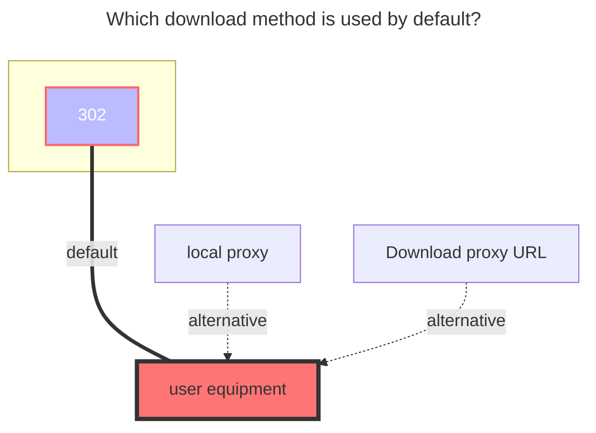
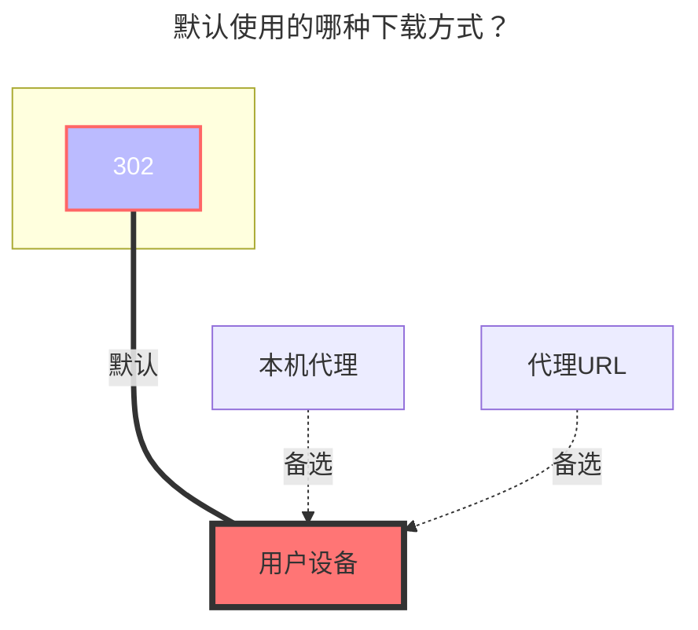

---
title:
  en: Degoo
  zh-CN: Degoo
categories:
  - guide
  - drivers
top: 587
---

https://degoo.com/

::: en
**Authentication methods**:

1. Username + Password
2. Refresh Token
3. Access Token

In normal cases, you can log in with your username + password. If you encounter a 429 error, you can log in using tokens. You can obtain the token from the request body or header in your browser.
:::
::: zh-CN
**鉴权方式**：

1. 用户名 + 密码
2. 刷新令牌
3. 访问令牌

正常情况下，可以使用用户名 + 密码进行登录。如果您遇到了429错误，可以使用令牌登录。您可以从浏览器的请求内容或头部中获取访问令牌。
:::

## Username { lang="en" }

## 用户名 { lang="zh-CN" }

::: en
Your user's name.
:::
::: zh-CN
您的用户名。
:::

## Password { lang="en" }

## 密码 { lang="zh-CN" }

::: en
Your user's password.
:::
::: zh-CN
您用户的密码。
:::

## Refresh Token { lang="en" }

## 刷新令牌 { lang="zh-CN" }

::: en
Refresh token for automatic token renewal, obtained automatically.
:::
::: zh-CN
用于自动更新令牌的刷新令牌，自动获取。
:::

## Access Token { lang="en" }

## 访问令牌 { lang="zh-CN" }

::: en
Access token for Degoo API, obtained automatically.
:::
::: zh-CN
Degoo API 访问令牌，自动获取。
:::

## The default download method used { lang="en" }

## 默认使用的下载方式 { lang="zh-CN" }

::: en

:::
::: zh-CN

:::
