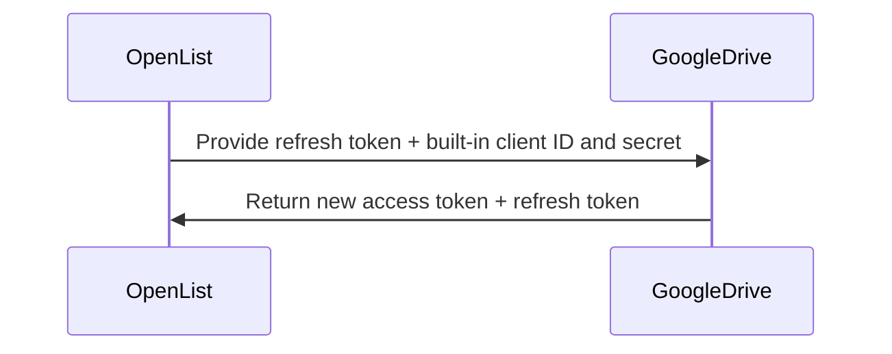
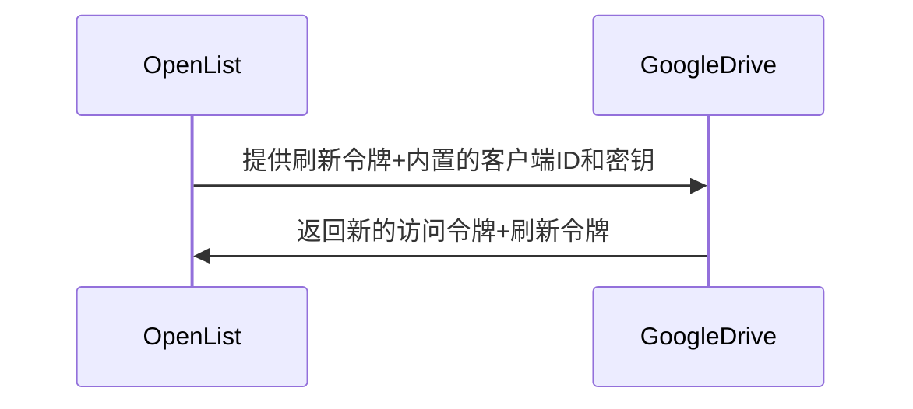
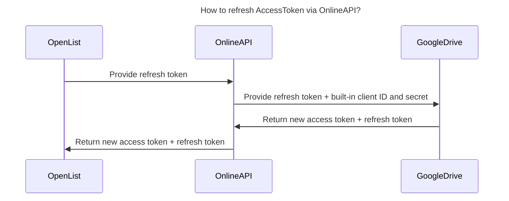
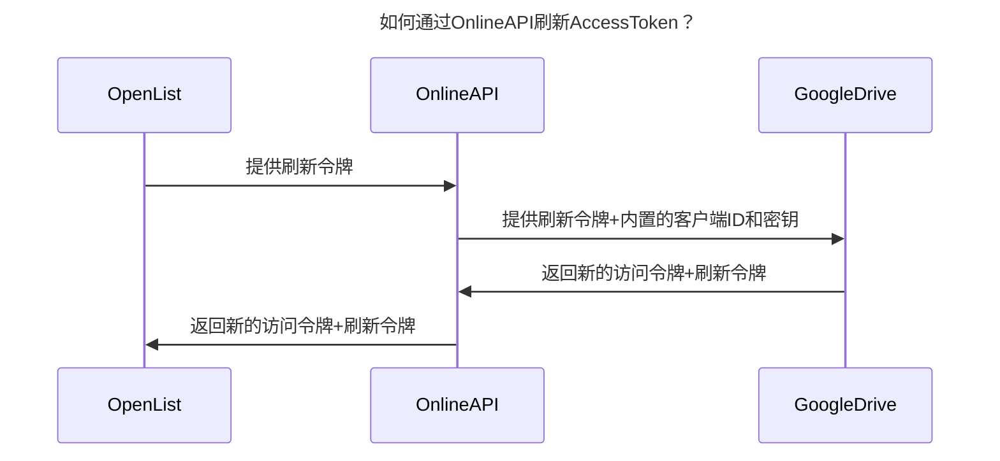
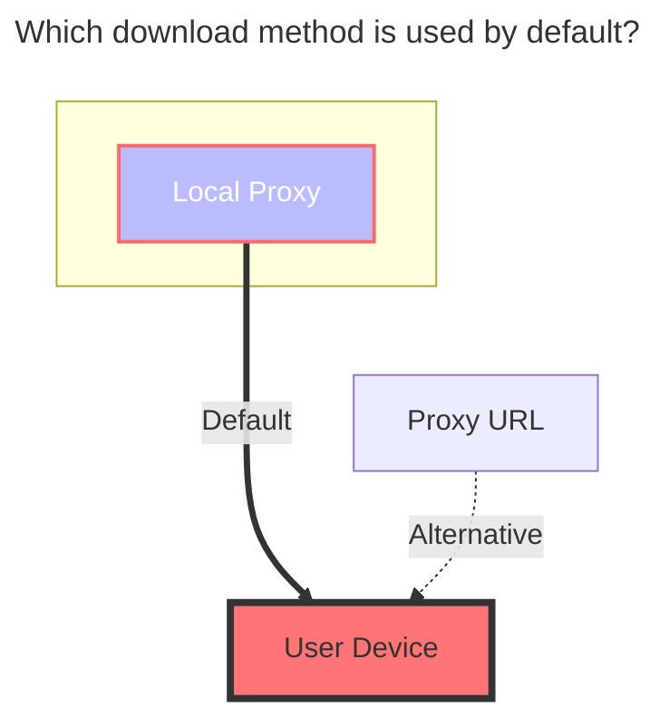
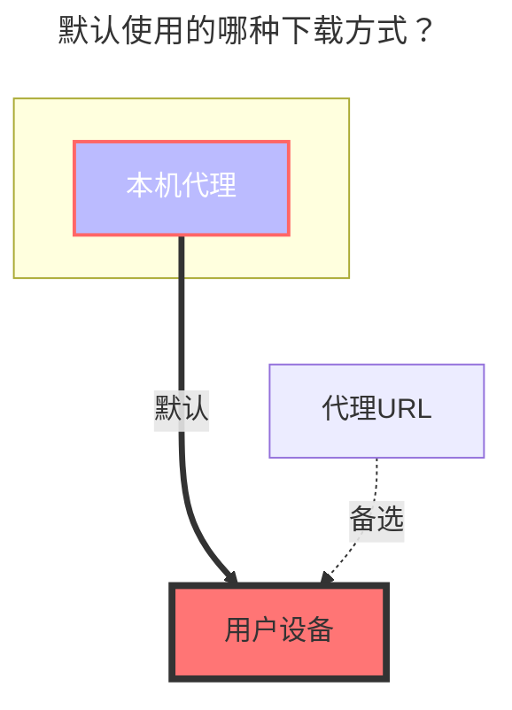

---
title:
  en: Google Drive
  zh-CN: 谷歌云盘
icon: iconfont icon-state
# This control sidebar order
top: 597
# A page can have multiple categories
categories:
  - guide
  - drivers
---

::: en

Official website: https://drive.google.com/

- Supports Team Drive (Enter the Team Drive directory ID for the Root Folder ID)

:::

::: zh-CN

官网：https://drive.google.com/

- 支持团队盘（根目录ID填写团队盘的目录ID）

:::

## 1. Prerequisites { lang="en" }

## 1. 必要条件 { lang="zh-CN" }

::: en

1. The machine on which the OpenList service is deployed must be able to connect to Google Drive.

2. The Google Drive API service must be enabled. For details on how to enable it, please refer to [Enabling the Google Drive API](#_2-1-enable-google-drive-api).

   > For detailed steps, see [Google Workspace > Google Drive > Quick Start Guide](https://developers.google.com/workspace/drive/api/quickstart/js).

:::
::: zh-CN

1. 搭建 OpenList 服务的机器必须能够连接到 Google 网盘。

2. 必须启用 Google 云盘 API 服务，具体启用方式请参考 [启用 Google Drive API](#21-启用-google-drive-api-的-api)。

   > 详细步骤可参考 [Google Workspace > Google Drive > 快速入门指南](https://developers.google.com/workspace/drive/api/quickstart/js)

:::

## 2. Preparation { lang="en" }

## 2. 准备接入 { lang="zh-CN" }

### 2.1. Enable Google Drive API { lang="en" }

### 2.1. 启用 Google Drive API 的 API { lang="zh-CN" }

::: en

1. On the [Guide Page](https://developers.google.com/workspace/drive/api/quickstart/js), locate the `Enable the API` button and click to proceed to the quick activation interface. Follow the instructions and confirm the settings to complete the activation process.

2. You can also visit the [Google Drive API Management Interface](https://console.cloud.google.com/apis/library/drive.googleapis.com). Find the `Enable` button at the top and click it; wait for the activation to complete.

3. `Quotas and System Limits Management`(optional): Switch to the `Quotas and System Limits` tab and set appropriate quotas and limits based on your usage and requirements.

:::
::: zh-CN

1. 在[指南页面](https://developers.google.com/workspace/drive/api/quickstart/js)中找到`启用API`按钮，点击进入快捷开启界面，点击下一步以及确认后，即可完成开启。

2. 也可以访问[谷歌云盘API功能管理界面](https://console.cloud.google.com/apis/library/drive.googleapis.com)，在上方找到`启用`按钮，点击后等待启用完成。

3. `配额和系统限制管理`（可选）：切换到`配额和系统限制`选项卡，根据你的使用情况和需求，设置合适的配额和限制。

:::

### 2.2. Creating an OAuth Client (Optional; not required if using OpenList, a public welfare server, or a self-built server) { lang="en" }

### 2.2. 创建 OAuth 客户端（可选，如果使用OpenList/公益服务器/自建服务器，则不用创建） { lang="zh-CN" }

::: en

1. On the [Credentials Page](https://console.cloud.google.com/apis/credentials?hl=en), click the `Create Credentials` dropdown menu and select and click `OAuth client ID`.
   > If prompted with `To create an OAuth client ID, you must first configure the consent screen`, click the `Configure consent screen` button, and complete the creation of the `Brand Information` on the subsequent page, selecting `External` for the `Audience`. After completion, return to the Credentials page to continue creating the OAuth client ID.
   > 
2. In the pop-up window, select `Web Application` and enter the name of your application type.
3. For the `Authorized redirect URIs`, enter `https://api.oplist.org/googleui/callback`. If you are using a self-built service or a non-profit organization, please enter the corresponding domain name, for example, `https://your-domain.com/googleui/callback`.
4. Click the `Create` button to complete the creation of the OAuth client. Note: Make sure to copy and save the `Client ID` and `Client Secret`; you will need them later on.

   

5. Add yourself as a test user: On the left side, find the `Audience` menu and click to enter it. Then, locate `Test Users` and click the `+ Add users` button. Enter your Google account email address and click `Save`.

   

6. After completing the testing, you can publish your application: On the left side, find the `Audience` menu and click to enter it. Then, locate `Publication Status` and click the `Publish app` button. Confirm the publication to complete the application release process.

   

:::
::: zh-CN

1. 在[凭据界面](https://console.cloud.google.com/apis/credentials?hl=zh-cn)中，点击`创建凭据`下拉菜单，选择和点击`OAuth 客户端 ID`

   > 如果提示`如需创建 OAuth 客户端 ID，您必须先配置权限请求页面`，请点击`配置同意屏幕`按钮，在后续页面中完成`品牌信息`的创建，其中`受众群体`请选择`外部用户`，完成后返回凭据页面继续创建 OAuth 客户端 ID。

   

2. 在弹出的窗口中，选择`Web 应用`，填写应用名称

3. 在`授权的重定向 URI`中，填写 `https://api.oplist.org/googleui/callback`，如果是自建或者公益服务，请填写对应的域名，如 `https://your-domain.com/googleui/callback`。

4. 点击`创建`按钮，完成 OAuth 客户端的创建。注：请复制和保存`客户端 ID`和`客户端密钥`，后续需要使用。

   

5. 将自己添加到测试用户中，在左侧找到`目标对象`菜单，点击进入后，找到`测试用户`下方的`+ Add User`按钮，点击后输入你的 Google 账号邮箱地址，点击添加即可。

   

6. 测试完毕后可以发布应用，在左侧找到`目标对象`菜单，点击进入后，找到`发布状态`下方的`发布应用`按钮，点击后确认发布即可完成应用发布。

   

:::

### 2.3. Get `Access Token` and `Refresh Token` { lang="en" }

### 2.3. 获取`访问密钥`和`刷新密钥` { lang="zh-CN" }

::: en

1. Open the [OpenList Google Authorization Page](https://api.oplist.org/). **⚠️ If you are using a public or self-hosted server, please proceed with that server.**

2. In the dropdown menu on the page, select `GoogleDrive Login`.

   
   

3. If you created an OAuth Client ID in the previous steps, please enter the Client ID and Client Secrets in the input fields below.

   
   

   Otherwise, check the box ☑️ to use the API provided by OpenList. **⚠️ If you are using a public or self-hosted server, the built-in Client ID and Client Secrets of that server will be used.**

   
   

4. Click the `Get Authorization` button. The system will redirect you to the Google Authorization page. Log in to your Google account and authorize OpenList to access your Google Drive.

   

5. If a message appears stating `This app has not been verified by Google`, click `Advanced` and then click `Go to oplist.org (insecure)` to continue. (If you are using a public or self-hosted server, the domain name here should match the actual domain name of the service; please verify this carefully.)

   

6. Pay attention to the permission information on the authorization page (within the red box in the image below). Make sure that the permission granted is only for accessing your Google Drive files. If you find that the permission includes access to something other than just your Google Drive files in the public service, please report an issue at [OpenListTeam/OpenList-Docs/issues](https://github.com/OpenListTeam/OpenList-Docs/issues).

   

7. After authorization is successful, the system will provide you with a `Refresh Token` and an `Access Token`. Please copy and save these tokens, as they will be used in subsequent configurations.

   
   

:::
::: zh-CN

1. 打开[OpenList Google 授权页面](https://api.oplist.org/) **⚠️如果使用公益服务器/自建服务器，请访问公益服务器/自建服务器**

2. 在页面中下拉框中选择`GoogleDrive Login`

   
   

3. 如果在上面的步骤中创建了 OAuth 客户端 ID，请在下方输入框中填写刚才创建的`客户端 ID`和`客户端密钥`

   
   

   否则勾选☑️使用 OpenList 提供的API。**⚠️如果使用的公益服务器/自建服务器，此时使用的是公益服务器/自建服务器内置的客户端ID和应用机密**

   
   

4. 点击`获取授权`按钮，系统会跳转到 Google 授权页面，登录你的 Google 账号，并授权 OpenList 访问你的 Google Drive。

   

5. 如果出现`此应用未经 Google 验证`的提示，请点击`高级`，然后点击`转至oplist.org（不安全）`继续。（如果是公益服务器/自建服务器，则此处域名以实际公益服务的域名为准，请仔细甄别）。

   

6. 请注意授权页面上（下图红色框内）的权限信息，确保**只是**访问你的 **谷歌云端硬盘文件**，如果在公益服务中发现该权限不仅仅是访问**谷歌云端硬盘**，请在[OpenListTeam/OpenList-Docs/issues](https://github.com/OpenListTeam/OpenList-Docs/issues)提起issues。

   

7. 授权成功后，系统会返回一个`刷新密钥`和`访问密钥`，请复制并保存该令牌，后续的配置中会使用。

   
   

:::

## 3. Add Google Drive in OpenList { lang="en" }

## 3. 在 OpenList 中添加谷歌云盘 { lang="zh-CN" }

### 3.1. Configuration { lang="en" }

### 3.1. 配置说明 { lang="zh-CN" }

#### 3.1.1. Root Folder ID { lang="en" }

#### 3.1.1. **根文件夹 ID** { lang="zh-CN" }

::: en

Similar to Aliyun Drive, it is the last string of the official website URL, such as:

:::
::: zh-CN

与阿里云盘类似，官网 URL 的最后一个字符串，如：

:::

### 3.2. Start Adding { lang="en" }

### 3.2. 开始添加 { lang="zh-CN" }

::: en

1. Open the management interface of OpenList and click on `Storage` in the left menu.

2. On the Storage List page, click the `Add Storage` button in the top right corner.

3. Select `Google Drive` as the drive.

   
   

4. Enter the mount path, for example: `google-drive`.

5. In the `Root Folder ID` field, enter the root folder ID obtained earlier; if you are using the root directory, enter `root`.

6. In the `Refresh Token` field, enter the refresh token obtained earlier (if not available, refer to [Preparing for Integration](#_2-preparation).

7. If you are using the OAuth client ID and key provided by OpenList (or a public welfare server/self-built server), follow steps 7.1 and 7.2:

   7.1. Check the `Use online API` option to indicate that you want to use the online API provided by OpenList.

   7.2. Enter `https://api.oplist.org/googleui/renewapi` as the API URL; if it’s a public welfare server/self-built server, enter the corresponding server address.

   
   

8. If you are using your own OAuth client ID and key, follow steps 8.1 and 8.2:

   8.1. Uncheck the `Use online API` option to indicate that you are using your own OAuth client ID and key.

   8.2. Enter your OAuth client ID in the `Client id` field and your OAuth Client secrets in the `Client secret` field.

   
   

9. Click the `Add` button to complete the addition of Google Drive.

:::
::: zh-CN

1. 打开 OpenList 的管理界面，点击左侧菜单中的`存储`。

2. 在存储列表页面，点击右上角的`添加存储`按钮。

3. 选择驱动为`谷歌云盘（Google Drive）`。

   
   

4. 输入挂载路径，如：`google-drive`。

5. 在`根文件夹 ID`中填写上面获取的根文件夹 ID，如果使用根目录，请填写`root`。

6. 刷新令牌中填写上面获取的刷新令牌（如未获取，请参考[准备接入](#_2-准备接入)）。

7. 如果你使用的是 `OpenList （或者公益服务器/自建服务器）`提供的 OAuth 客户端 ID 和密钥，请按照`7.1`和`7.2`进行配置

   7.1. 在`Use online api`中勾选，表示使用 OpenList 提供的在线 API。

   7.2. Api url address填写为 `https://api.oplist.org/googleui/renewapi`，如果是`公益服务器/自建服务器`，请填写对应的服务器地址。

   
   

8. 如果你使用的是自己创建的 OAuth 客户端 ID 和密钥，请按照`8.1`和`8.2`进行配置

   8.1. 在`Use online api`中不勾选，表示使用自建的 OAuth 客户端 ID 和密钥。

   8.2. 在`客户端ID`中填写你的`Oauth 客户端 ID`，在`客户端密钥`中填写你的`Oauth 客户端密钥`

   
   

9. 点击`添加`按钮，完成谷歌云盘的添加。

:::

## 4. About `Use online api` option { lang="en" }

## 4. 关于`Use online api`选项的说明 { lang="zh-CN" }

### 4.1. AccessToken refresh method with own keys { lang="en" }

### 4.1. 自身有密钥的情况下，AccessToken刷新的方式 { lang="zh-CN" }

::: en

:::
::: zh-CN

:::

### 4.2. AccessToken refresh method without own keys { lang="en" }

### 4.2.自身没有密钥的情况下，AccessToken刷新的方式 { lang="zh-CN" }

::: en

:::
::: zh-CN

:::

## 5. The default download method used { lang="en" }

## 5. 默认使用的哪种下载方式？ { lang="zh-CN" }

::: en

:::
::: zh-CN

:::
