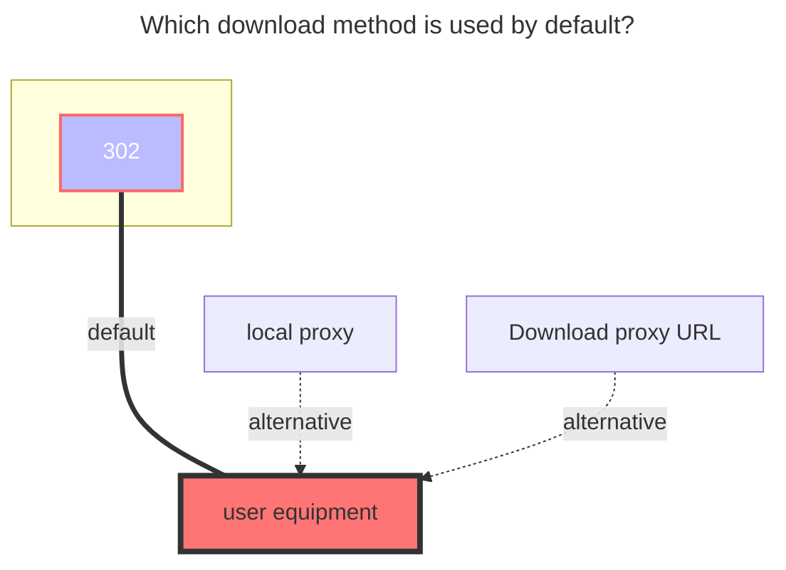
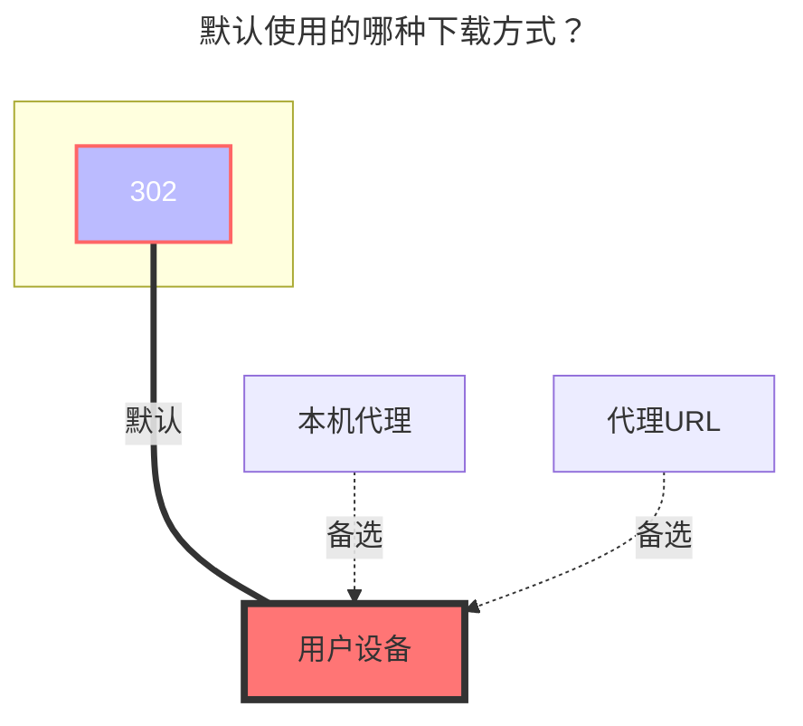

---
title:
  en: halalcloud
  zh-CN: 6盘
icon: iconfont icon-state
# This control sidebar order
top: 679
# A page can have multiple categories
categories:
  - guide
  - drivers
# A page can have multiple tags
tag:
  - Storage
  - Guide
  - '本地代理'
  - '官方'
# this page is sticky in article list
sticky: true
# this page will appear in starred articles
star: true
---

::: en

- `6盘（halalcloud）` Official website：[https://2dland.cn](https://2dland.cn/)
  - Cloud Login：https://drive.2dland.cn
- Official announcement, document address：https://2dland.yuque.com/r/organizations/homepage

:::

::: zh-CN

- `6盘（halalcloud）` 官方网站：[https://2dland.cn](https://2dland.cn/)
  - 网盘登录：https://drive.2dland.cn
- 官方公告、文档地址：https://2dland.yuque.com/r/organizations/homepage

:::

## Root folder file_id { lang="en" }

## 根文件夹 ID { lang="zh-CN" }

::: en
Top address bar path，Root folder file_id is:`/`
Subfolder: `/A folder/C folder/C folder`
:::
::: zh-CN
顶部地址栏路径，根文件夹是：`/`
子文件夹：`/A文件夹/C文件夹/C文件夹`
:::

## Fill in the example { lang="en" }

## 填写示例 { lang="zh-CN" }

::: en

On the HalalCloud (6 盘) website, go to `User Center` and navigate to `Authorization Management`. Enter your HalalCloud account password to verify your identity.

Create a new authorization (you can name it anything you like). Click `Confirm`, then copy and save the `Client ID` and `Client Secret`.

In the OpenList admin panel, go to `Storage` and add a new driver. Select `HalalCloudOpen`, and enter the `Client ID` and `Client Secret` obtained from the previous step.

:::
::: zh-CN

在 `6盘官网`内点击`用户中心`，进入`授权管理`页面，输入 6 盘账户密码验证身份。

新建一个授权，名称可随意，点击确定后记录并保存`Client ID`和`Client Secret`。

在 OpenList 后台的存储页添加驱动，选择`HalalCloudOpen`，在下方填写`客户端 ID` 和`客户端密钥`，分别对应上方的值即可。

:::

## Other parameters { lang="en" }

## 其它参数 { lang="zh-CN" }

::: en

- `Upload thread`: Upload threads (Default: 3, Range: 1-32)

- `Host`: (Provided by default, no input required)

- `WebDAV Policy`: Default is `302 Redirect`. Switch to `Local Proxy` if you encounter any issues.

:::
::: zh-CN

- `Upload thread`：上传线程（默认为 3，范围 1-32）

- `主机`：（默认已给出，无需填写）

- `WebDav策略`：默认为`302重定向`，若有问题可以修改为`本地代理`

:::

### The default download method used { lang="en" }

### 默认使用的下载方式 { lang="zh-CN" }

::: en

:::
::: zh-CN

:::
