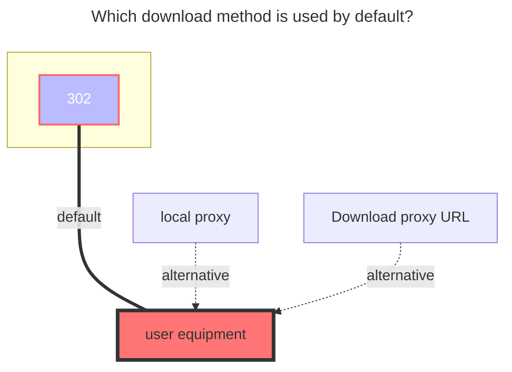
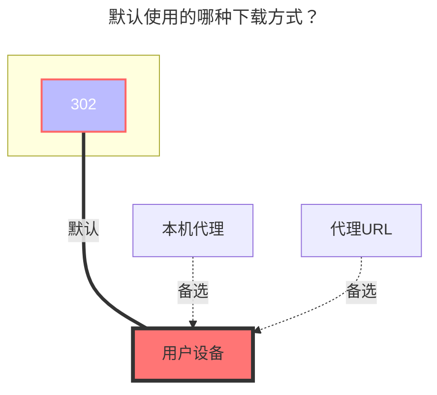
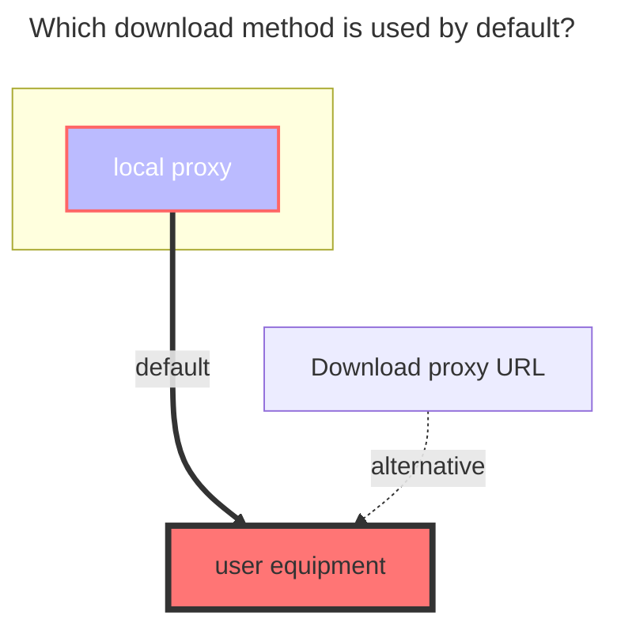
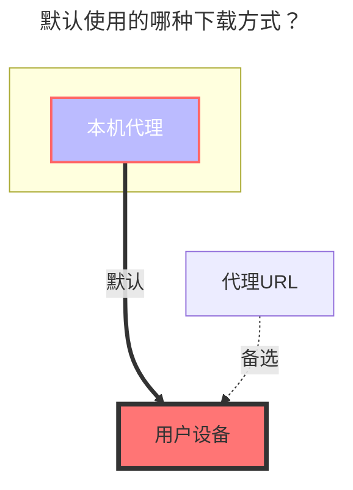

---
title:
  en: OneDrive / Share
  zh-CN: OneDrive / 分享
icon: iconfont icon-state
# This control sidebar order
top: 599
# A page can have multiple categories
categories:
  - guide
  - drivers
---

:::en
:::tip

- If you have global administrator permissions for a non-home edition, you can use the [OneDrive APP](onedrive_app.md) driver.
- If your account does not support the API, (for example, the school account has not verified the administrator, or the administrator has disabled the API), then you can also mount it through webdav. For details, see [webdav](webdav.md)

:::

:::zh-CN
:::tip

- 如果你拥有非家庭版的全局管理员权限，可使用 [OneDrive APP](onedrive_app.md) 驱动
- 如果你的账号不支持 API，（比如学校账号没有验证管理员，或者管理员禁用了 API），那么你也可以通过 WebDAV 挂载。有关详细信息，请参阅 [WebDAV 页面](webdav.md)

:::

## 1. Mounting using Online API's default application { lang="en" }

## 1. 使用在线 API 的默认应用挂载 { lang="zh-CN" }

::: en
You do not need to create an application yourself by mounting in this way.

1. Open <https://api.oplist.org> and select the corresponding OneDrive version according to your account.

2. Check "Use parameters provided by OpenList", click "Get Token", then log in to the OneDrive account you want to mount. After authorization, return to the page to get the refresh token.

   

3. Go to the storage management interface of OpenList, select the OneDrive driver, check "Use online API", fill in the refresh token and you can mount it.

   

:::
::: zh-CN
通过这种方式挂载，您无需自行创建应用。

1. 打开 <https://api.oplist.org>，根据自己的账户选择对应的 OneDrive 版本。

2. 勾选“使用 OpenList 提供的参数”，点击“获取Token”后登录需要挂载的 OneDrive账号，授权后返回页面即可获得刷新令牌。

   

3. 前往 OpenList 的存储管理界面选择 OneDrive 驱动，勾选“使用在线API”，填入刷新令牌后即可挂载

   

:::

## 2. Mounting by creating an application manually { lang="en" }

## 2. 手动创建应用挂载 { lang="zh-CN" }

::: en

The application provided by OpenList API may experience issues such as request rate limits due to a high number of users. In this case, you can manually create an application.

1. Navigate to the corresponding management page based on your account type.
   - OneDrive Global：https://portal.azure.com/#blade/Microsoft_AAD_RegisteredApps/ApplicationsListBlade
   - OneDrive 21vianet：https://portal.azure.cn/#blade/Microsoft_AAD_RegisteredApps/ApplicationsListBlade
   - OneDrive Germany：https://portal.microsoftazure.de/#blade/Microsoft_AAD_RegisteredApps/ApplicationsListBlade
   - OneDrive US GOV：https://portal.azure.us/#blade/Microsoft_AAD_RegisteredApps/ApplicationsListBlade

2. After logging in, select `Register Application`, enter `Name`, and select `Accounts and Individuals in Any Organization Directory` (note that you don't look at the location selection but the text here. Some people may be the middle option, don't select a single Tenant or other options, otherwise it will cause problems when logging in), enter the `Redirect URL` as `https://api.oplist.org/onedrive/callback`, click `Register`, and then you can get the `client_id`.

   

3. After registering the application, select `Certificate and Password`, click `New Client Password`, enter a string of passwords, select the one with the longest time, and click `Add`.

   (Note: The password entered after adding will disappear, please record the value of client_secret)

   

4. Select `API Permissions`, click `MicroSoft Graph`, enter file in the `Select Permissions`, and check `Files.read` (Note: `Files.read` is a read-only minimum permission. The permission in the figure is larger, and the same can be done), click `Update Permission`.

   

5. Fill in the `client_id` and `client_secret` obtained in the previous step into <https://api.oplist.org> page, click `Get Token`.

6. Go to OpenList's add storage page, uncheck "Use online API", and fill in the obtained `client_id`, `client_secret`, `Callback URL`, and `Refresh Token` in OpenList.

:::

::: zh-CN

OpenList 在线 API 提供的默认应用程序因为用户太多，可能存在请求速率限制等问题。此时您可以手动创建应用程序。

1. 根据您的账号类型，进入对应的管理页面
   - OneDrive 国际版：https://portal.azure.com/#blade/Microsoft_AAD_RegisteredApps/ApplicationsListBlade
   - OneDrive 世纪互联：https://portal.azure.cn/#blade/Microsoft_AAD_RegisteredApps/ApplicationsListBlade
   - OneDrive 德国版：https://portal.microsoftazure.de/#blade/Microsoft_AAD_RegisteredApps/ApplicationsListBlade
   - OneDrive 美国版：https://portal.azure.us/#blade/Microsoft_AAD_RegisteredApps/ApplicationsListBlade

2. 登陆后选择 `注册应用程序`，输入`名称`，选择`任何组织目录中的账户和个人`（注意这里不要看位置选择而是看文字，部分人可能是中间那个选项，不要选成单一租户或者其他选项，否则会导致登陆时出现问题），输入`重定向 URL`为 `https://api.oplist.org/onedrive/callback` ，点击注册即可，然后可以得到 `client_id`

   

3. 注册好应用程序之后，选择`证书和密码`，点击`新客户端密码`，输入一串密码，选择时间为最长的，点击`添加`

   （注：在添加之后输入的密码之后会消失，请记录下来 `client_secret` 的值）

   

4. 选择 `API 权限`，点击 `Microsoft Graph`，在`选择权限`中输入 `file`，勾选 `Files.read`（注：`Files.read` 是只读最小权限，图中权限较大，也同样可以），点击`确定`

   

5. 将上一步骤中获得的 `client_id` 和 `client_secret` 填入 <https://api.oplist.org> ，点击`获取Token`

6. 进入 OpenList 添加存储页面，取消勾选`使用在线API`，将获取到的 `client_id`、`client_secret`、`Callback URL`、`Refresh Token` 填入 OpenList 中

:::

## Parameters { lang="en"}

## 参数 { lang="zh-CN"}

### Sharepoint site_id { lang="en" }

### SharePoint 站点 ID { lang="zh-CN" }

::: en
If you need to mount SharePoint, after completing the above steps, there will be an input field for the site address below the refresh token display. Enter the site address, click to get the `site_id`, and then fill the obtained information into the `site_id` field on the OpenList add storage page. Make sure `Is sharepoint` is enabled.
:::
::: zh-CN
如果需要挂载 SharePoint，完成上面的步骤后，在显示刷新令牌的界面的下面有输入站点地址，输入站点地址后点击获取 `site_id`，然后将获取到的信息填入 OpenList 添加存储页面的 `站点ID` 中，确保已启用 `是否Sharepoint`。
:::

### Root folder path { lang="en" }

### 根文件夹路径 { lang="zh-CN" }

::: en
The default is `/`, if you need to customize, just fill in the path, starting from the root path, the same as the local path, such as `/test`
:::
::: zh-CN
默认为 `/`，如果需要自定义，就填路径就行，从根路径开始，和本地路径一样，比如 `/test`
:::

### Chunk size { lang="en" }

### 分片大小 { lang="zh-CN" }

::: en
Upload chunk size (MiB). The default is `5`, which means `5 * 1024 * 1024 = 5,242,880` bytes. Make sure to use a size that is a multiple of 320 KiB (`327,680` bytes).
:::
::: zh-CN
上传分片大小（MiB），默认值为 `5`，即 `5 * 1024 * 1024 = 5,242,880` 个字节，需要确保使用 320 KiB（`327,680` 个字节）倍数的字节大小。
:::

### Custom host { lang="en" }

### 自定义HOST { lang="zh-CN" }

::: en
Custom accelerated download link. This is the domain name of your reverse-proxied OneDrive download API (for example, for personal accounts: `my.microsoftpersonalcontent.com`). Only domain replacement is supported here, not path replacement.

::: warning

- Only hostname replacement is supported, not path.
- Be sure to properly isolate and only reverse proxy your own paths, otherwise your Cloudflare account may be banned!

:::
::: zh-CN
自定义加速下载链接。即反代你的 OneDrive 下载 API （如个人版：`my.microsoftpersonalcontent.com`）的域名。

::: warning

- 此处仅支持替换主机名，不支持路径。
- 请务必做好隔离，仅反向代理您自己的路径，否则会导致 Cloudflare 账号被封禁！

:::

## The default download method used { lang="en" }

## 默认使用的下载方式 { lang="zh-CN" }

::: en



:::
::: zh-CN



:::

## 3. OneDrive Share Url { lang="en" }

## 3. OneDrive 分享 { lang="zh-CN" }

<!--@include: @/snippets/reverse-tip.md-->

::: en

:::
::: zh-CN

:::

### Url { lang="en" }

### 链接 { lang="zh-CN" }

::: en
The sharing link is the same as the example below and can be mounted. It can be obtained from E3, E5, A1, and A1P.

```html
https://connecthkuhk-my.sharepoint.com/:f:/g/personal/jhyang13_connect_hku_hk/EsEgHtGOWbJImxop6tF15FIBIH-ihrjuDclbrbmwWfY_RA?e=s6fitN
```

If it is OneDrive personal version, it will not work. The link is as follows

```html
https://onedrive.live.com/?cid=64EA5FCC7735E8C6&id=64EA5FCC7735E8C6%2117289
```

:::
::: zh-CN
分享链接是这样的可以挂载，来自E3、E5、A1、A1P等

```html
https://connecthkuhk-my.sharepoint.com/:f:/g/personal/jhyang13_connect_hku_hk/EsEgHtGOWbJImxop6tF15FIBIH-ihrjuDclbrbmwWfY_RA?e=s6fitN
```

如果是OneDrive个人版的就不行，链接如下

```html
https://onedrive.live.com/?cid=64EA5FCC7735E8C6&id=64EA5FCC7735E8C6%2117289
```

:::

### Password { lang="en" }

### 密码 { lang="zh-CN" }

::: en
It is the extraction code. If you have it, write it. If you don’t have it, don’t fill it in.
:::
::: zh-CN
就是提取码，如果有就写，如果没有就不用写
:::

### The default download method used { lang="en" }

### 默认使用的下载方式 { lang="zh-CN" }

::: en



:::
::: zh-CN



:::
