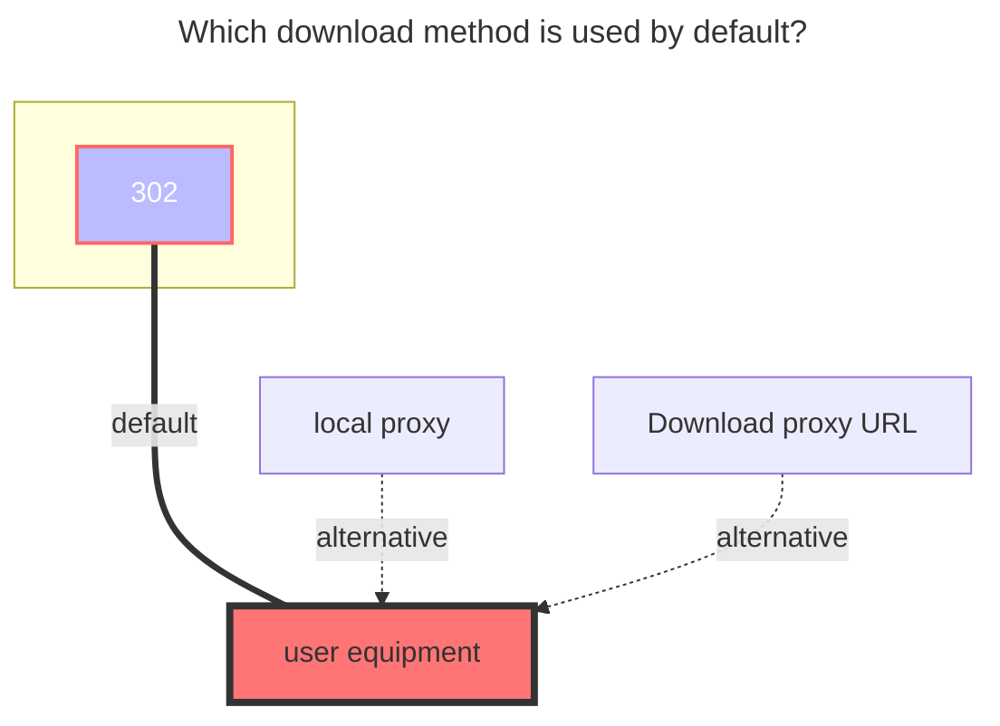
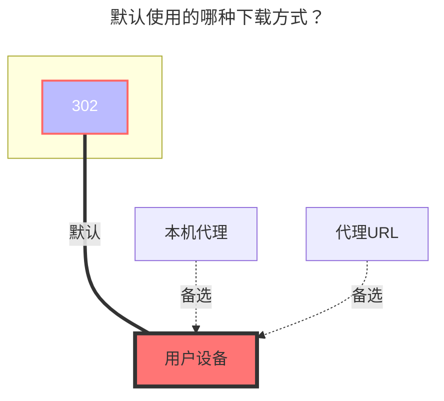

---
title:
  en: OpenList
  zh-CN: OpenList
icon: iconfont icon-state
# This control sidebar order
top: 499
# A page can have multiple categories
categories:
  - guide
  - drivers
---

::: en
Support mounting OpenList directories running on other servers

:::
::: zh-CN
支持挂载其他服务器中运行的 OpenList 目录

:::

## 链接 { lang="zh-CN" }

## Url { lang="en" }

::: en
OpenList link you want to mount

:::
::: zh-CN
你要挂载的 OpenList 链接

:::

## 用户名 { lang="zh-CN" }

## Username { lang="en" }

::: en
username

When `username&password` is not filled in, `guest` is used for guest access.

:::
::: zh-CN
用户名

不填写 `用户名&密码` 时使用的是 `guest` 游客访问

:::

## 密码 { lang="zh-CN" }

## Password { lang="en" }

::: en
password

:::
::: zh-CN
密码

:::

## 根文件夹ID { lang="zh-CN" }

## Root folder path { lang="en" }

::: en
The default root directory for the path to mount to is`/`

:::
::: zh-CN
要挂载到的路径，默认根目录为 `/`

:::

## 元信息密码 { lang="zh-CN" }

## Meta password { lang="en" }

::: en
The OpenList path you want to mount has a meta information password set. You need to know what the other party's password is set to see the file, otherwise it will be blank after entering

If multiple folders have different password settings, the password you fill in can only enter the folder with this password, and those without this password cannot enter

:::
::: zh-CN
你要挂载的 OpenList 路径设置了元信息密码，你要知道对方的密码设置的是什么才能看到文件，不然进去后是空白

如果多个文件夹密码设置的不一样，那么你填写的密码只能进入这个密码的文件夹，不是这个密码的进不去

:::

::: en
::: danger
If you first use the `username&password` method for mounting, and then switch to using the `metadata password` method for mounting, you need to manually clear the previously automatically filled `token`, otherwise you will still use the `username&password` method for mounting

:::

::: zh-CN
::: danger
若你先使用 `用户名&密码` 方式挂载，后面切换成了使用 `元信息密码` 方式挂载，你需要手动将之前自动填充的 `令牌` 清除，否则还是会使用 `用户名&密码` 方式挂载

:::

## 令牌 { lang="zh-CN" }

## Token { lang="en" }

::: en
You don’t need to write, it will be automatically filled after filling in `Username & Password` and saving

:::
::: zh-CN
可以不用写，在填写 `用户名&密码` 保存后会自动填充

:::

## 代理range { lang="zh-CN" }

## Proxy Range { lang="en" }

::: en
You need to enable `Web Proxy` or `Webdav Native Proxy` to take effect

Mount '139Yun' on the OpenList of the server and go to 302. Then, locally mount the OpenList on the server through the OpenList enabled proxy to play videos,achieving the goal of not using server traffic. The CMCC mobile card can also be streamed free

:::
::: zh-CN
需要先启用 `Web代理` 或者 `Webdav本地代理` 才会生效

服务器的 OpenList 挂载 `139Yun` 走302，然后本地通过开启代理的 OpenList 挂载服务器上的 OpenList 播放视频等，达到不使用服务器流量的目的，移动卡还能免流

:::

## 错误提示 { lang="zh-CN" }

## Error message { lang="en" }

::: en
::: danger
If the OpenList you mounted is "not" enabled Allow Mount, you will not be able to To mount, the following error is prompted

```json
Failed init storage: the site does not allow mounted
failed get objs: storage not init: the site does not allow mounted
```

Solution: Use the allowed `username&password` provided by the other party for mounting

:::

::: zh-CN
::: danger
若是你挂载的 OpenList "未"开启允许挂载，那你将无法进行挂载，提示如下错误

```json
Failed init storage: the site does not allow mounted
failed get objs: storage not init: the site does not allow mounted
```

解决方法：使用对方提供的允许挂载的 `用户名&密码` 进行挂载

:::

:::en
::: danger

If the other party does not enable the guest account access permission, an error will be prompted when mounting (as follows)

```json
failed get objs: failed to list objs: request failed,code: 400, message: Key: 'LoginReq.Username' Error:Field validation for 'Username' failed on the 'required' tag
```

Solution: Use the allowed `username&password` provided by the other party for mounting

:::

::: zh-CN
::: danger
如果对方未开启游客账户访问权限挂载时会提示错误(如下)

```json
failed get objs: failed to list objs: request failed,code: 400, message: Key: 'LoginReq.Username' Error:Field validation for 'Username' failed on the 'required' tag
```

解决方法：使用对方提供的允许挂载的 `用户名&密码` 进行挂载

:::

## 默认使用的下载方式 { lang="zh-CN" }

## The default download method used { lang="en" }

::: en



:::
::: zh-CN



:::
