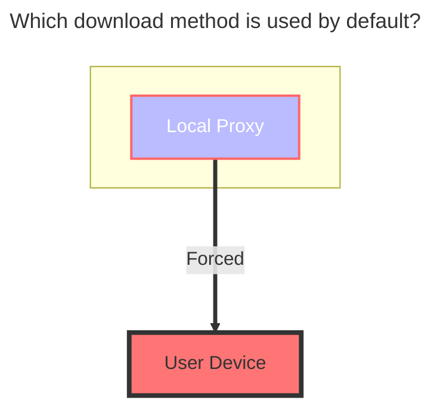
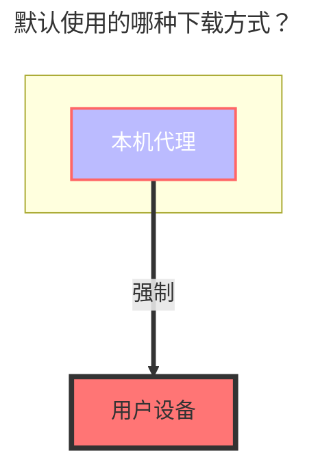
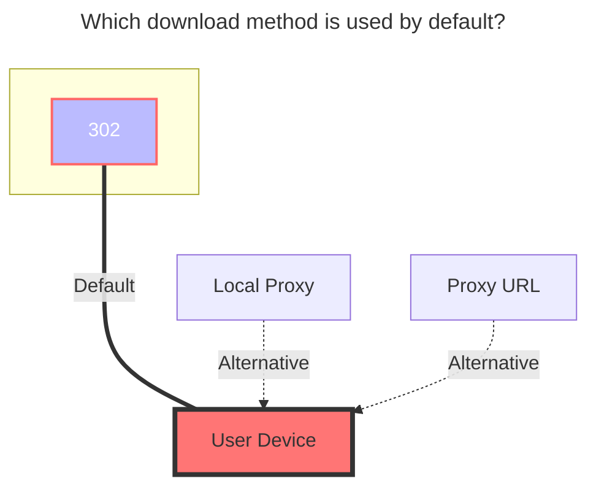
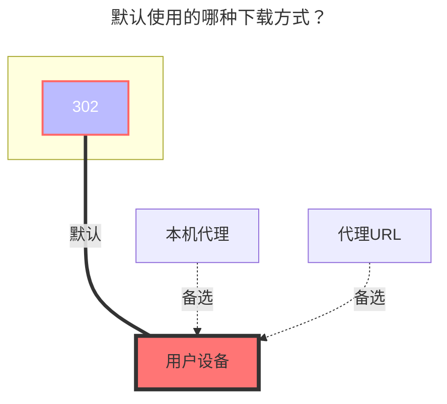
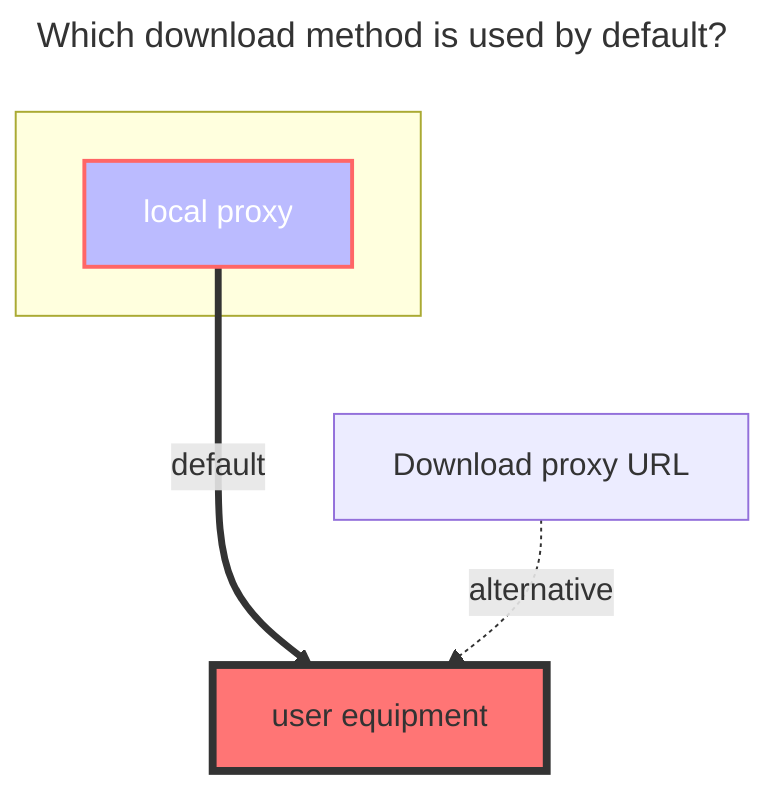
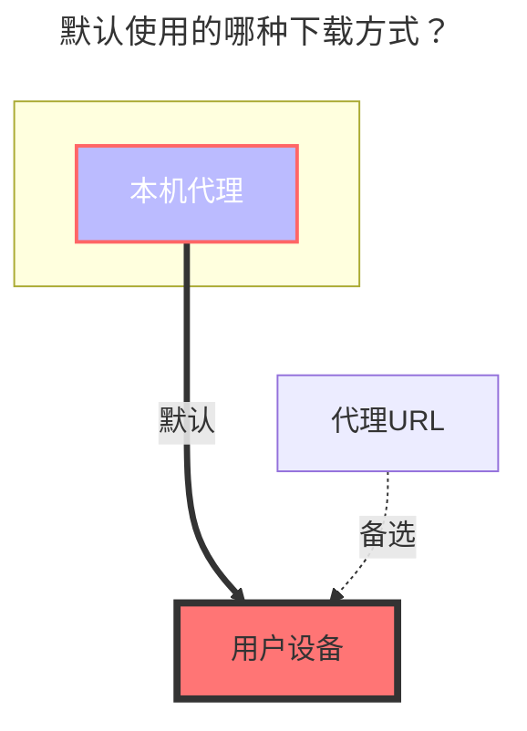

---
title:
  en: Quark / TV / Open
  zh-CN: 夸克网盘 / TV / Open
icon: iconfont icon-state
# This control sidebar order
top: 684
# A page can have multiple categories
categories:
  - guide
  - drivers
# A page can have multiple tags
tag:
  - Storage
  - Guide
  - '本地代理'
  - '302'
# this page is sticky in article list
sticky: true
# this page will appear in starred articles
star: true
---

<!--@include: @/snippets/reverse-tip.md-->

https://pan.quark.cn

:::en
:::danger
Due to Quark Cloud Drive's speed limit issues, it can now only use local proxy for transfers. [See details here](https://github.com/alist-org/alist/issues/4318#issuecomment-1536214188)
:::

:::zh-CN
:::danger
由于夸克网盘限速问题，夸克网盘现在只能使用本地代理进行传输，[说明详见](https://github.com/alist-org/alist/issues/4318#issuecomment-1536214188)

:::

## 1. Quark { lang="en" }

## 1. 夸克网盘 { lang="zh-CN" }

### Cookie { lang="en" }

### Cookie { lang="zh-CN" }

:::en
Press F12 to open "Developer Tools", select "Network", choose any request on the left, and find the one with the `Cookie` parameter.
:::
:::zh-CN
按F12打开“调试”，选中“网络”，随意在左侧选择请求，找到携带 `Cookie` 参数的就可以
:::

### Root Folder ID { lang="en" }

### 根文件夹ID { lang="zh-CN" }

:::en
The root directory ID is `0`.

- For subfolder IDs, enter the folder and get the directory ID from the top address bar. The deeper the subdirectory, the further back the directory ID is in the address bar. To mount a specific subdirectory, just use its directory ID.

:::
:::zh-CN
根目录ID为 `0`

- 子文件夹ID进入文件夹后顶部地址栏获取目录ID，如果子目录越深目录ID在地址栏越靠后，想挂载哪个子目录就写那个子目录ID就可以

:::

:::en
Note: Please use Chrome browser to obtain Cookies. If you use Firefox, you may remain as a guest and be prompted to log in.
:::
:::zh-CN
注意：请使用Chrome浏览器来获取Cookies，使用Firefox获取的Cookies或仍将停留在访客并请求登录。
:::

### [Online Preview/Download] is Slow? { lang="en" }

### [在线预览/下载]很慢? { lang="zh-CN" }

:::en
Quark Cloud Drive downloads are slow because a **membership** is required, and mounting can only (forcibly) use the `local proxy` method, which means your OpenList server needs to have high bandwidth.

- What is `local proxy`?
  - `Local proxy` means your OpenList server acts as a relay: it first downloads to your OpenList server, then forwards to you. If your server's speed is not fast enough, the forwarding speed to you will also be slow.

1. Use a server with higher bandwidth as a relay
2. Set up at home on your own computer
3. Or simply give up using it.

:::
:::zh-CN
夸克云盘下载很慢是因为夸克云盘需要开通**会员**，并且挂载只能(强制)使用`本地代理`方式，就需要你搭建OpenList的机器有一个很高的带宽速度

- 什么是`本地代理`？
  - `本地代理`就是你搭建OpenList的机器来中转,就是先下载到你搭建OpenList的机器，再由机器转发给你，你搭建OpenList的机器速度不够快，再转发给你的速度自然也不够快

1. 换带宽高的服务器来中转
2. 在自己家里电脑搭建
3. 直接放弃不用.

:::

### Default Download Method { lang="en" }

### 默认使用的下载方式 { lang="zh-CN" }

:::en

:::

:::zh-CN

:::

:::en
Note: [**alist/issues/4318**](https://github.com/alist-org/alist/issues/4318#issuecomment-1536214188)
:::
:::zh-CN
说明：[**alist/issues/4318**](https://github.com/alist-org/alist/issues/4318#issuecomment-1536214188)
:::

## 2. Quark TV { lang="en" }

## 2. 夸克TV { lang="zh-CN" }

:::en
The TV version supports `302`, but only the `access` and `download` operations are supported; other operations are not supported (not available in the API).
:::
:::zh-CN
TV 版支持 `302`，但是只能 `访问` 和 `下载` 两个操作，其它操作不支持(接口不支持)
:::

### How to Add { lang="en" }

### 添加方式 { lang="zh-CN" }

:::en

1. Select the `QuarkTV` driver, fill in the mount path, and save.
2. Return to the drivers page, use the mobile app to scan the QR code (if the QR code is not displayed, click `Table Layout` in the upper right corner of the driver to switch from list mode to table mode).
3. After scanning and confirming, disable the driver, then enable the driver again to use it.
   - `Refresh token`, `Device id`, and `Query token` will be filled in automatically, no manual input required.
     - Please do not edit or modify them manually.

:::
:::zh-CN

1. 选择 `夸克TV / QuarkTV` 驱动，填写挂载路径，然后保存
2. 返回全部驱动页面，使用手机APP扫描二维码（如果不显示二维码，驱动右上角点击点击`表格布局` 从列表模式切换成表格模式）
3. 扫码确认后，禁用驱动，再启用`驱动`即可使用
   - `Refresh token 刷新令牌`、`Device id 设备ID `、`Query token` 会自动填充，不需要人工填写
     - 请不要进行编辑手动修改

:::

### Root Folder ID { lang="en" }

### 根文件夹ID { lang="zh-CN" }

:::en
The root directory ID is `0`.

- For subfolder IDs, enter the folder and get the directory ID from the top address bar. The deeper the subdirectory, the further back the directory ID is in the address bar. To mount a specific subdirectory, just use its directory ID.

:::
:::zh-CN
根目录ID为 `0`

- 子文件夹ID进入文件夹后顶部地址栏获取目录ID，如果子目录越深目录ID在地址栏越靠后，想挂载哪个子目录就写那个子目录ID就可以

:::

### Default Download Method { lang="en" }

### 默认使用的下载方式 { lang="zh-CN" }

:::en

:::
:::zh-CN

:::

## 3. Quark Open { lang="en" }

## 3. 夸克Open { lang="zh-CN" }

:::en
:::danger
This "Open" is not an open interface in the true sense.

No further tutorials are provided.
:::

:::zh-CN
:::danger
该“Open”并非真正意义上的开放接口。

不提供进一步的教程。
:::

### Usage { lang="en" }

### 使用方法 { lang="zh-CN" }

:::en

- Select `Quark Cloud Drive (OAuth2) Authentication Login` at [here](https://api.oplist.org).
- Fill in the AppID and SignKey you obtained to get the refresh token.
- Due to the lack of relevant documentation, please use the **online API** for refreshing.

:::
:::zh-CN

- 在[这里](https://api.oplist.org)选择`夸克网盘 (OAuth2) 验证登录`。
- 根据自己获取到的AppID、SignKey填写，获取刷新令牌。
- 因为缺少相关文档，请使用**在线api**进行刷新

:::

### The default download method used { lang="en" }

### 默认使用的下载方式 { lang="zh-CN" }

:::en

:::
:::zh-CN

:::
