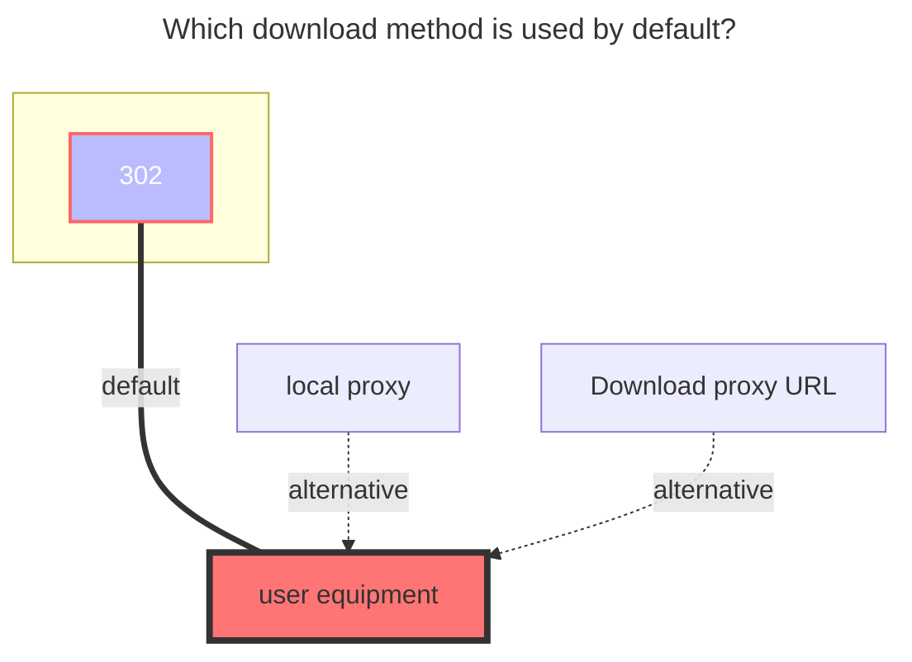
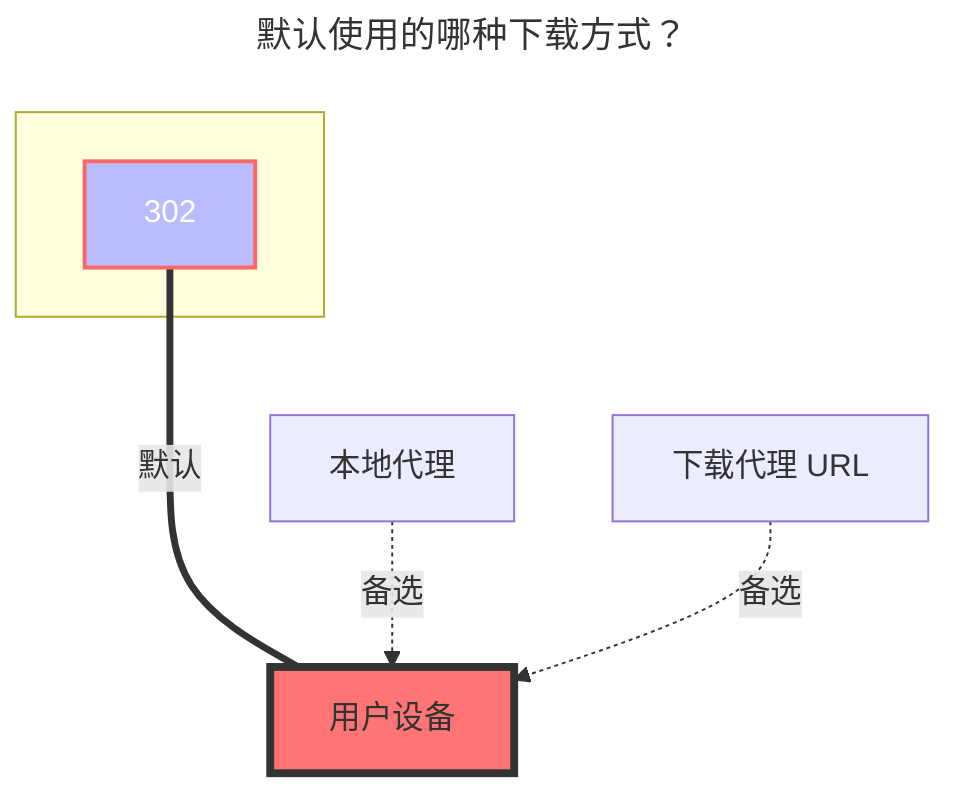

---
title:
  en: Teldrive
  zh-CN: Teldrive
icon: iconfont icon-state
# This control sidebar order
top: 586
# A page can have multiple categories
categories:
  - guide
  - drivers
# A page can have multiple tags
tag:
  - Storage
  - Guide
  - '302'
# this page is sticky in article list
sticky: true
# this page will appear in starred articles
star: true
---

<!--@include: @/snippets/tos-tip.md-->

::: en
Teldrive is a Telegram-based cloud storage app maintained by a third-party open-source project: [tgdrive/teldrive](https://github.com/tgdrive/teldrive).

**Highlights**

- Unlimited storage
- No file size limit
- If you don’t subscribe to Telegram Premium, bandwidth is limited, and speed depends on the distance and bandwidth quality between your account’s data center (DC1–DC5) and the Teldrive server.

Backend deployment requires a **Telegram API (not Bot API)**. See the official guide: [Teldrive installation](https://teldrive-docs.pages.dev/docs/getting-started/prerequisites)
:::
::: zh-CN
Teldrive 是一个基于 Telegram 的云存储应用，由第三方开源仓库维护：[tgdrive/teldrive](https://github.com/tgdrive/teldrive)。

**功能特点**

- 无限存储空间
- 无文件大小限制
- 未订阅 Telegram Premium 时带宽会受限，速度取决于你的账户数据中心（DC1–DC5）与 Teldrive 服务之间的距离和带宽质量。

部署后端需要 **Telegram API（不是 Bot API）**。完整安装指南见：[Teldrive 安装教程](https://teldrive-docs.pages.dev/docs/getting-started/prerequisites)
:::

## Address { lang="en" }

## 地址 { lang="zh-CN" }

::: en
Enter the base URL of your Teldrive backend **without** a trailing slash.

Example: `https://teldrive.example.com`
:::
::: zh-CN
填写 Teldrive 后端的基础网址，**不要**包含末尾斜杠 `/`。

示例：`https://teldrive.example.com`
:::

## Authentication (Cookie) { lang="en" }

## 认证（Cookie） { lang="zh-CN" }

::: en
Only **Cookie** authentication is supported.

After logging in to the Teldrive web UI, grab the cookie from your browser.

The cookie should **start with** `access_token=` and is a JWT.

::: tip
You only need the string **containing** `access_token=`.
:::
::: zh-CN
仅支持 **Cookie** 方式认证。

登录 Teldrive 网页端后，从浏览器中获取 Cookie。

Cookie 应当以 `access_token=` 开头，这是一个 JWT。

::: tip
只需要**包含** `access_token=` 的那一串字符串。
:::

## Download methods { lang="en" }

## 下载方式 { lang="zh-CN" }

::: en
**Note**: If `Use Share Link` is enabled, a shared file link is created and the download URL is valid for **1 hour**.

Otherwise, you need to enable OpenList's `Web Proxy`.
:::
::: zh-CN
**注意**：如果启用了 `使用分享链接` 选项，将会创建共享文件链接，下载链接有效期为 **1 小时**。

否则，您需要启用 OpenList 的 Web 代理。
:::

## Chunk size { lang="en" }

## 分块大小 { lang="zh-CN" }

::: en
Upload chunk size in **MiB**.

Default: `10` (10 MiB). If large uploads fail, try a smaller value.

If the chunk size is larger than the file size, the file is uploaded in a single thread without chunking.
:::
::: zh-CN
上传时的分块大小，单位 **MiB**。

默认值：`10`（10 MiB）。若大文件上传失败，可尝试调小。

当分块大小大于文件本身大小时，不会分块，文件将以单线程上传。
:::

## Upload Concurrency { lang="en" }

## 上传并发数量 { lang="zh-CN" }

::: en
Concurrent upload threads. Default: `4`.

Adjust based on available memory. A handy estimate is:  
`memory ≈ chunk_size × concurrency`
:::
::: zh-CN
上传并发线程数，默认：`4`。

请根据可用内存调整，粗略计算：  
`内存占用 ≈ 分块大小 × 并发数`
:::

## The default download method used { lang="en" }

## 默认使用的下载方式 { lang="zh-CN" }

::: en

:::
::: zh-CN

:::
