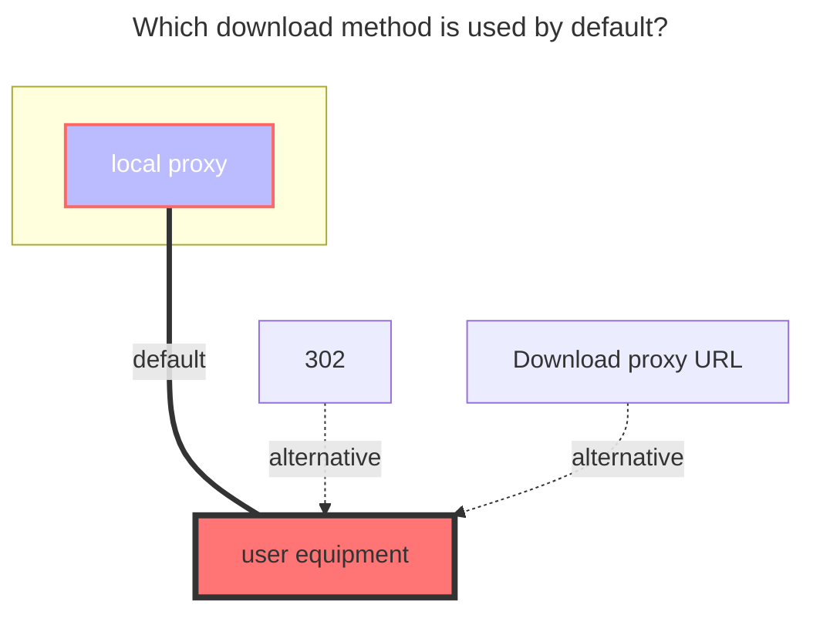
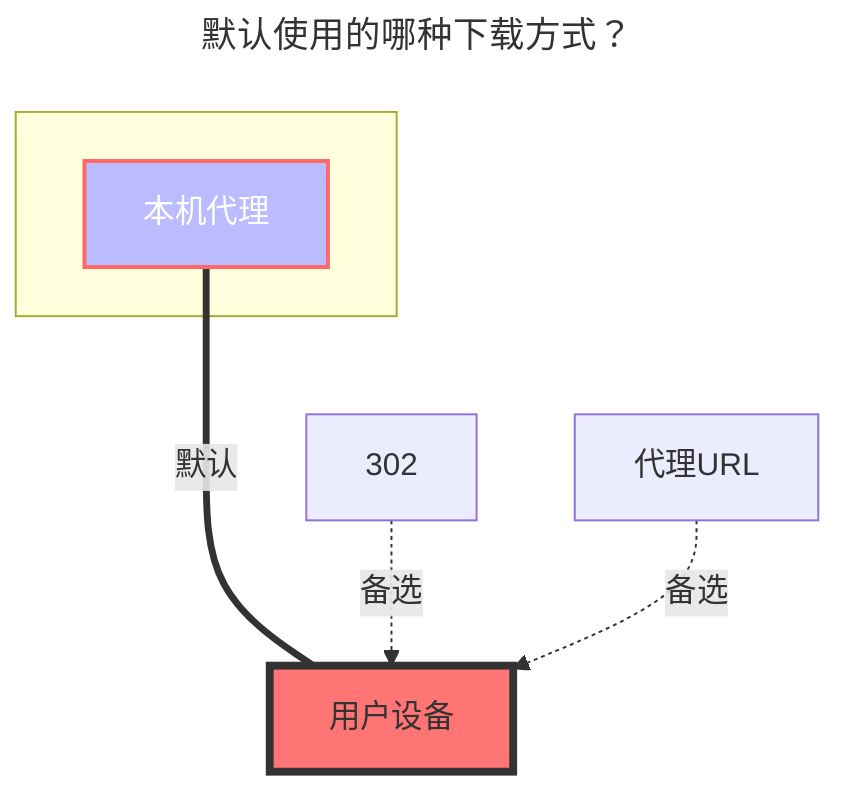

---
title:
  en: WebDav
  zh-CN: WebDAV
icon: iconfont icon-state
# This control sidebar order
top: 899
# A page can have multiple categories
categories:
  - guide
  - drivers
---

## 地址 { lang="zh-CN" }

## Address { lang="en" }

::: en
WebDAV root address
:::
::: zh-CN
WebDAV 根地址
:::

## 用户名 { lang="zh-CN" }

## Username { lang="en" }

::: en
username
:::
::: zh-CN
用户名
:::

## 密码 { lang="zh-CN" }

## Password { lang="en" }

::: en
password
:::
::: zh-CN
密码
:::

## 根文件夹ID { lang="zh-CN" }

## Root folder path { lang="en" }

::: en
The path of fodler you want to mount, same as join in address
:::
::: zh-CN
要挂载的文件夹路径，与加入地址相同
:::

## Tls insecure skip verify { lang="zh-CN" }

## 跳过 SSL 证书验证 { lang="zh-CN" }

::: en
Whether to skip SSL certificate verification. If your WebDAV server uses a self-signed certificate, you may need to enable this option. Enabling it will reduce security, please use it with caution.
:::
::: zh-CN
是否跳过 SSL 证书验证。如果你的 WebDAV 服务器使用自签名证书，可能需要启用此选项。启用后会降低安全性，请谨慎使用。
:::

## Support 302 redirect { lang="en" }

## 支持 302 重定向 { lang="zh-CN" }

::: zh-CN

通常情况下，WebDAV 服务器会直接返回文件内容，由于需要授权，只能代理下载。但一些服务器会重定向到实际的文件地址，如 OpenList `WebDav 策略` 的 `302 重定向`。

WebDAV 存储设置的 `Web 代理` 选项默认为开启状态，如果关闭，OpenList 将会尝试获取重定向后的地址，然后将该地址返回给用户设备直接下载。

前提条件：

1. WebDAV 服务器必须支持返回 302，如果返回 200，则无法使用此功能，关闭 Web 代理将无法使用。
2. 返回的 302 地址必须是公开可访问的地址，不得需要授权信息，否则用户设备无法下载。
3. 在存储设置中关闭 `Web 代理` 选项。

:::

::: en

In general, WebDAV servers return the file content directly. Due to the need for authorization, only proxy downloads are possible. However, some servers redirect to the actual file address, such as OpenList `WebDav Policy`'s `302 Redirect`.

The `Web Proxy` option in WebDAV storage settings is enabled by default. If disabled, OpenList will attempt to obtain the redirected address and return it to the user device for direct download.

Prerequisites:

1. The WebDAV server must support returning 302; if it returns 200, this feature cannot be used, and disabling Web Proxy will make it unusable.
2. The returned 302 address must be publicly accessible and must not require authorization information; otherwise, the user device cannot download it.
3. Disable the `Web Proxy` option in the storage settings.

:::

## OneDrive/SharePoint { lang="zh-CN" }

## OneDrive/SharePoint { lang="en" }

::: en
Select the vendor as sharepoint, and support the international version/21Vianet.

For OneDrive/SharePoint, you can obtain the webdav root address through [this tool](https://tool.example.com/onedrive/webdav). If you want to mount the specified directory, you can join it later.

The username is the OneDrive account email, and the password is the OneDrive account password.
:::
::: zh-CN
选择 vendor 为 sharepoint，支持国际版/世纪互联。

你可以通过[这个工具](https://alist.example.com/tool/onedrive/webdav.html)获取 WebdAV 根地址，如果要挂载指定的目录，在后面拼接即可。

用户名为 OneDrive 账号邮箱，密码即为 OneDrive 账号密码。
:::

## 错误提示 { lang="zh-CN" }

## Error message { lang="en" }

::: en

- **failed get objs: failed to list objs: PROPFIND/根目录：403**

  Need to log in to [Entra ID](https://entra.microsoft.com/#view/Microsoft_AAD_IAM/TenantOverview.ReactView?Microsoft_AAD_IAM_legacyAADRedirect=true)

  Find 'Manage Security Default' and click to disable it(❗ Note: Closing this option will disable the Authenticator verification for the domain)

  

  Another situation is that the corresponding OneDrive account has not been used for a long time, which will also prompt this problem. Try to log in to the account again from the OneDrive web page. The system will prompt you to change the password. After updating the password, try again with the changed password.

- **failed link: failed get link: redirect failed, status: 200**

  This error indicates that the WebDAV server does not support 302 redirects. You need to enable the `Web Proxy` option in the storage settings to use proxy downloads.

:::
::: zh-CN

- **failed get objs: failed to list objs: PROPFIND/根目录：403**

  需登陆 [Entra ID](https://entra.microsoft.com/#view/Microsoft_AAD_IAM/TenantOverview.ReactView?Microsoft_AAD_IAM_legacyAADRedirect=true)

  找到 `管理安全默认值` 点击并禁用（❗注：此项关闭后会关闭域的 Authenticator 验证）

  

  另外一种情况是对应的 OneDrive 账号太长时间没有操作也会提示这个问题，尝试从 OneDrive 网页端重新登录账号，系统会提示要求更改密码，更新密码后，使用更改后的密码再次尝试即可

- **failed link: failed get link: redirect failed, status: 200**

  此错误表示 WebDAV 服务器不支持 302 重定向，需要在存储设置中启用 `Web 代理` 选项以使用代理下载。

:::

## 默认使用的下载方式 { lang="zh-CN" }

## The default download method used { lang="en" }

::: en

:::

::: zh-CN

:::
