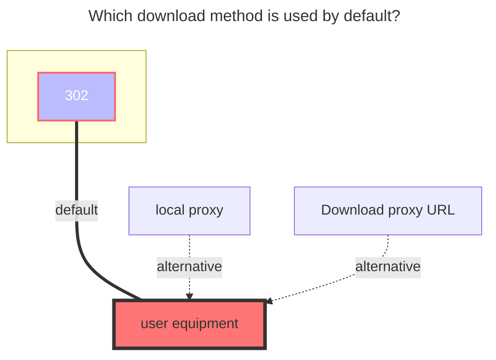
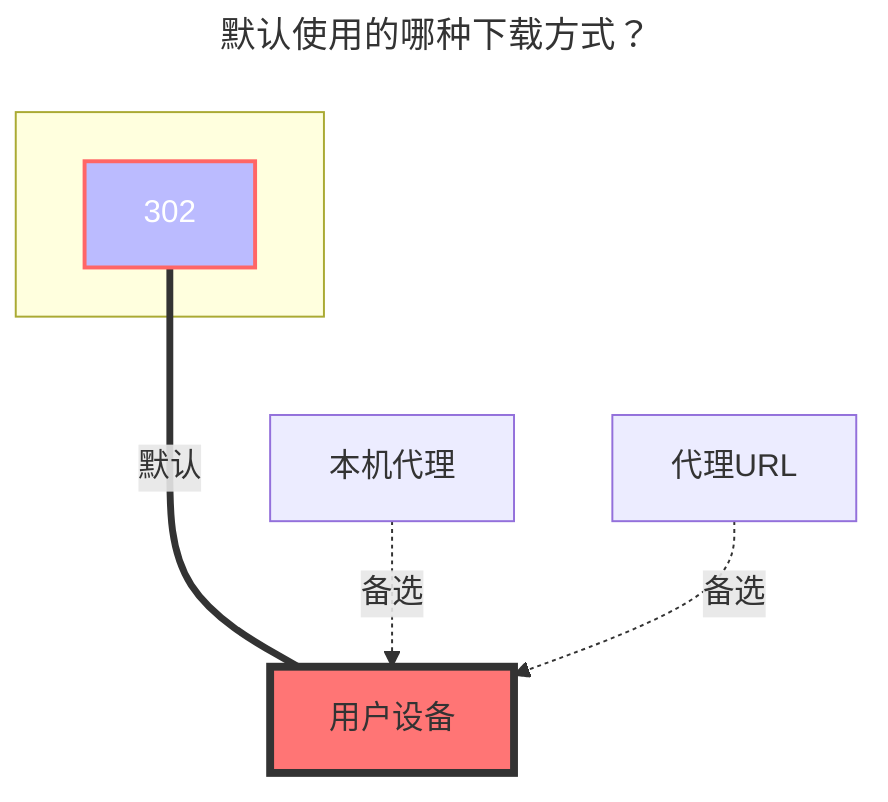

---
title:
  en: WoPan
  zh-CN: 中国联通云盘
icon: iconfont icon-state
# This control sidebar order
top: 693
# A page can have multiple categories
categories:
  - guide
  - drivers
# A page can have multiple tags
tag:
  - Storage
  - Guide
  - '302'
# this page is sticky in article list
sticky: true
# this page will appear in starred articles
star: true
---

<!--@include: @/snippets/reverse-tip.md-->

[https://pan.wo.cn/](https://pan.wo.cn/)

## GetToken { lang="en" }

## 获取令牌 { lang="zh-CN" }

::: en
::: tip
The difference between the two token acquisition methods:

- Method 1: **Token valid for seven days** Logging in to the web version of China Unicom Cloud Drive will disconnect and invalidate the mount point on OpenList's side. However, logging in to the mobile version is fine, and thereby you can have both open simultaneously.

- Method 2: **Token valid for two months** There isn't any problem to log into the Unicom Cloud Drive. However, it will be kicked off if you log in on the mobile side.

:::

::: zh-CN
::: tip
两个令牌获取方法的区别：

- 方法1：**令牌有效期为七天**，如果登录网页端的联通云盘会将OpenList挂载的踢下线导致失效，登录手机端没问题，不会被踢下线，可以同时并存。

- 方法2：**令牌有效期为两个月**，登录网页端的联通云盘没问题，如果登录手机端则会将OpenList挂载的踢下线导致失效。

:::

### Method 1 { lang="en" }

### 方法一 { lang="zh-CN" }

::: en

1. Open developer tools
2. Open the official website <https://pan.wo.cn/> to log in
3. Find the request with this content:
   
4. Find the token in the response:
   

:::
::: zh-CN

1. 打开开发者工具
2. 打开官网 <https://pan.wo.cn/> 登录
3. 找到请求内容为这个的请求：
   
4. 在响应中找到token：
   

:::

### Method 2 { lang="en" }

### 方法二 { lang="zh-CN" }

::: en

1. Open developer tools
2. Open the official website <https://panservice.mail.wo.cn/h5/wocloud_ai/login> to login
3. Find the Apps tab in Developer Tools and select Session Storage:
   
4. Follow the arrows in the diagram to find the `Refresh Token` and the `Access Token`

:::
::: zh-CN

1. 打开开发者工具
2. 打开官网 <https://panservice.mail.wo.cn/h5/wocloud_ai/login> 登录
3. 在开发者工具中找到应用选项卡，并选择会话存储空间：
   
4. 根据图中箭头指引找到`刷新令牌`和`访问令牌`

:::

## Root folder ID { lang="en" }

## 根文件夹ID { lang="zh-CN" }

::: en

- **Personal cloud：**：**0**
  - Single folder ID：Unknown (wait for replenishment)
- **Family cloud**：Unknown (wait for replenishment)
  - Family cloud Single folder ID：Unknown (wait for replenishment)

:::

::: zh-CN

- 个人云：**0**
  - 单独文件夹ID：未知(后续补充)
- 家庭云：未知(后续补充)
  - 家庭云单独文件夹ID：未知(后续补充)

:::

## Type { lang="en" }

## 类型 { lang="zh-CN" }

::: en
Personal cloud：Put the `family ID` blank is the personal cloud
Family cloud：add `Family ID` Log in to the [SmartHome] -> [我的] -> [您的家], click"+" [Invite] -> [微信邀请], send the link to yourself, open it and copy all the text after 'groupId='.
:::
::: zh-CN
个人云：将`Family ID`空着就是个人云
家庭云：填写`Family ID` 登录【联通智家APP】->【我的】->【您的家】，点击"+"【邀请家人】->【微信邀请】，将链接发送给自己，打开后复制“groupId=”后面的全部文本
:::

## OpenList fill in examples： { lang="en" }

## OpenList挂载填写示例： { lang="zh-CN" }

::: en
Data obtained by using tools `Refresh_token Fill in the refresh token`, `Access_token fills in access_token`

:::
::: zh-CN
将使用工具获取的 `refresh_token填入刷新令牌`，`access_token填入访问令牌`

:::

## The default download method used { lang="en" }

## 默认使用的下载方式 { lang="zh-CN" }

::: en

:::
::: zh-CN

:::
